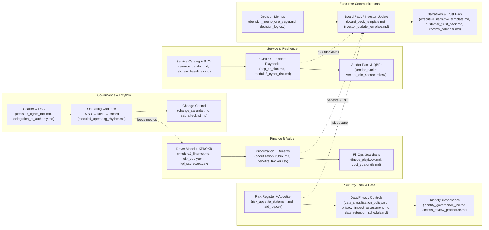
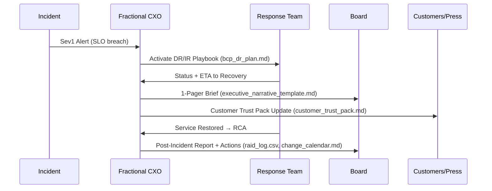
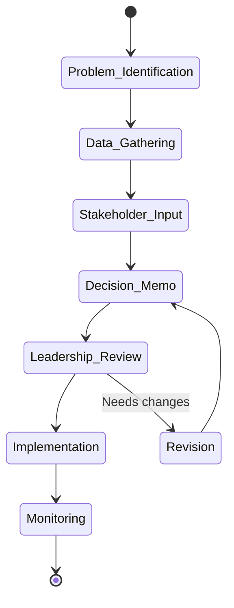
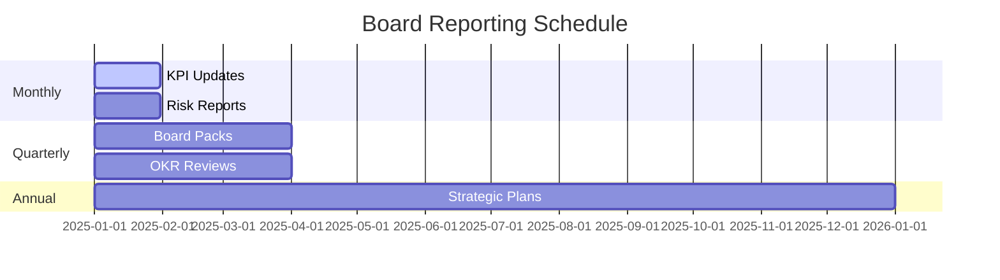
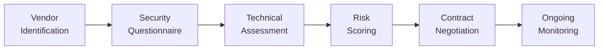
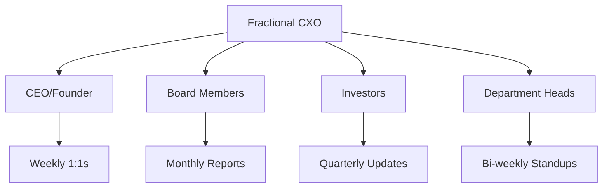

# 🏛️ Fractional Tech CXO Program — Boardroom-Ready Playbook


> **One-line value:** A complete, boardroom-caliber operating system for Fractional CIO/CTO/CISO leaders—governance, finance, security, operating rhythm, and investor-credible artifacts in a repeatable toolkit.

---

## Table of Contents
- [Executive Summary](#executive-summary)
- [Learning Outcomes](#learning-outcomes)
- [Repository Map](#repository-map)
- [Boardroom Workflows](#boardroom-workflows)
  - [Operating System (Swimlanes)](#operating-system-swimlanes)
  - [Risk → Finance Integration](#risk--finance-integration)
  - [Crisis → Communications Command](#crisis--communications-command)
  - [Decision Framework](#decision-framework)
  - [Board Reporting Cadence](#board-reporting-cadence)
  - [Vendor Assessment Pipeline](#vendor-assessment-pipeline)
  - [Stakeholder Communication Matrix](#stakeholder-communication-matrix)
- [Tooling Catalog (Board-Ready Templates)](#tooling-catalog-board-ready-templates)
  - [Governance & Decision Rights](#governance--decision-rights)
  - [Finance, KPIs & Prioritization](#finance-kpis--prioritization)
  - [Security, Risk & Data Governance](#security-risk--data-governance)
  - [Resilience & Continuity](#resilience--continuity)
  - [Vendors & Commercials](#vendors--commercials)
  - [Program Control & Architecture](#program-control--architecture)
  - [Service Levels & Trust](#service-levels--trust)
  - [Executive Communications](#executive-communications)
- [Quickstart](#quickstart)
- [First Week Actions](#first-week-actions)
- [Deliverables Checklist](#deliverables-checklist)
- [Assessment Rubric](#assessment-rubric)
- [License](#license)

---

## Executive Summary
This program turns your repo into a **living portfolio** and operating system for Fractional Tech CXOs. You’ll ship investor-credible artifacts—governance charters, KPI/OKR systems, risk registers, incident playbooks, vendor packs, FinOps guardrails, SLO baselines, board packs—and wire them into a cadence that reliably creates value.

---

## Learning Outcomes
By completion, you will be able to:
1. **Govern** with clear decision rights, charters, and escalation.  
2. **Model & decide** with driver-based finance, KPIs/OKRs, and prioritization rubrics.  
3. **Secure & de-risk** via risk registers, data governance, identity controls.  
4. **Operate & recover** with SLOs, DR tests, change control, and WBR/MBR/Board cadence.  
5. **Communicate** in board-ready briefs, investor updates, and crisis narratives.  
6. **Prove impact** through benefits tracking and a portfolio Kanban.

---

## Repository Map
```text
fractional-tech-cxo-excellence/
│
├── README.md
├── syllabus/
│   ├── module1_governance.md
│   ├── module2_finance.md
│   ├── module3_cyber_risk.md
│   └── module4_operating_rhythm.md
│
├── tools/
│   ├── governance_charter.md
│   ├── decision_rights_raci.md
│   ├── decision_memo_one_pager.md
│   ├── board_pack_template.md
│   ├── investor_update_template.md
│   ├── okr_tree.yaml
│   ├── kpi_scorecard.csv
│   ├── kpi_dictionary.md
│   ├── prioritization_rubric.md
│   ├── portfolio_kanban.md
│   ├── benefits_tracker.csv
│   ├── risk_appetite_statement.md
│   ├── delegation_of_authority.md
│   ├── data_classification_policy.md
│   ├── data_retention_schedule.md
│   ├── privacy_impact_assessment.md
│   ├── identity_governance_jml.md
│   ├── access_review_procedure.md
│   ├── bcp_dr_plan.md
│   ├── finops_playbook.md
│   ├── cost_guardrails.md
│   ├── raid_log.csv
│   ├── change_calendar.md
│   ├── cab_checklist.md
│   ├── decision_log.csv
│   ├── adr_template.md
│   ├── capability_heatmap.md
│   ├── service_catalog.md
│   ├── slo_sla_baselines.md
│   ├── comms_calendar.md
│   ├── executive_narrative_template.md
│   └── customer_trust_pack.md
│
└── vendor_pack/
    ├── msa_template.md
    ├── sow_template.md
    ├── sla_template.md
    └── dpa_template.md
````

---

## Boardroom Workflows

### Operating System (Swimlanes)



### Risk → Finance Integration

```mermaid
flowchart TD
  A[Risk Register<br/>(module3_cyber_risk.md)] --> B[Quantify Impact in $<br/>(module2_finance.md)]
  B --> C[Prioritize via RICE/WSJF<br/>(prioritization_rubric.md)]
  C --> D[Budget & Sequencing<br/>(finops_playbook.md)]
  D --> E[Benefits Tracking<br/>(benefits_tracker.csv)]
  E --> F[Board/Investor Roll-up<br/>(board_pack_template.md, investor_update_template.md)]
```

### Crisis → Communications Command



### Decision Framework



### Board Reporting Cadence



### Vendor Assessment Pipeline



### Stakeholder Communication Matrix



---

## Tooling Catalog (Board-Ready Templates)

### Governance & Decision Rights

* **Charter & DoA:** [tools/governance\_charter.md](tools/governance_charter.md), [tools/delegation\_of\_authority.md](tools/delegation_of_authority.md)
* **Decision Rights & Memos:** [tools/decision\_rights\_raci.md](tools/decision_rights_raci.md), [tools/decision\_memo\_one\_pager.md](tools/decision_memo_one_pager.md), [tools/decision\_log.csv](tools/decision_log.csv)

### Finance, KPIs & Prioritization

* **OKRs/KPIs:** [tools/okr\_tree.yaml](tools/okr_tree.yaml), [tools/kpi\_scorecard.csv](tools/kpi_scorecard.csv), [tools/kpi\_dictionary.md](tools/kpi_dictionary.md)
* **Prioritization & Benefits:** [tools/prioritization\_rubric.md](tools/prioritization_rubric.md), [tools/portfolio\_kanban.md](tools/portfolio_kanban.md), [tools/benefits\_tracker.csv](tools/benefits_tracker.csv)
* **FinOps:** [tools/finops\_playbook.md](tools/finops_playbook.md), [tools/cost\_guardrails.md](tools/cost_guardrails.md)

### Security, Risk & Data Governance

* **Risk & Appetite:** [tools/risk\_appetite\_statement.md](tools/risk_appetite_statement.md), [tools/raid\_log.csv](tools/raid_log.csv)
* **Data & Privacy:** [tools/data\_classification\_policy.md](tools/data_classification_policy.md), [tools/data\_retention\_schedule.md](tools/data_retention_schedule.md), [tools/privacy\_impact\_assessment.md](tools/privacy_impact_assessment.md)
* **Identity & Access:** [tools/identity\_governance\_jml.md](tools/identity_governance_jml.md), [tools/access\_review\_procedure.md](tools/access_review_procedure.md)

### Resilience & Continuity

* **BCP/DR:** [tools/bcp\_dr\_plan.md](tools/bcp_dr_plan.md)
* **Change & CAB:** [tools/change\_calendar.md](tools/change_calendar.md), [tools/cab\_checklist.md](tools/cab_checklist.md)

### Vendors & Commercials

* **Vendor Pack:** [vendor\_pack/msa\_template.md](vendor_pack/msa_template.md), [vendor\_pack/sow\_template.md](vendor_pack/sow_template.md), [vendor\_pack/sla\_template.md](vendor_pack/sla_template.md), [vendor\_pack/dpa\_template.md](vendor_pack/dpa_template.md)

### Program Control & Architecture

* **Architecture & Capability:** [tools/adr\_template.md](tools/adr_template.md), [tools/capability\_heatmap.md](tools/capability_heatmap.md)
* **Service Catalog:** [tools/service\_catalog.md](tools/service_catalog.md), [tools/slo\_sla\_baselines.md](tools/slo_sla_baselines.md)

### Service Levels & Trust

* **Customer Trust:** [tools/customer\_trust\_pack.md](tools/customer_trust_pack.md)

### Executive Communications

* **Board & Investor:** [tools/board\_pack\_template.md](tools/board_pack_template.md), [tools/investor\_update\_template.md](tools/investor_update_template.md)
* **Narratives & Calendar:** [tools/executive\_narrative\_template.md](tools/executive_narrative_template.md), [tools/comms\_calendar.md](tools/comms_calendar.md)

---

## Quickstart

```bash
# 1) Clone
git clone https://github.com/<you>/fractional-tech-cxo-excellence.git
cd fractional-tech-cxo-excellence

# 2) Tailor governance & authority
code tools/governance_charter.md tools/delegation_of_authority.md tools/decision_rights_raci.md

# 3) Wire finance & KPIs
code syllabus/module2_finance.md tools/okr_tree.yaml tools/kpi_scorecard.csv tools/kpi_dictionary.md

# 4) Stand up risk & data governance
code syllabus/module3_cyber_risk.md tools/risk_appetite_statement.md tools/data_classification_policy.md tools/privacy_impact_assessment.md

# 5) Publish cadence & comms
code syllabus/module4_operating_rhythm.md tools/board_pack_template.md tools/investor_update_template.md tools/comms_calendar.md
```

---

## First Week Actions

* Map stakeholders & draft **Charter + DoA** → `tools/governance_charter.md`, `tools/delegation_of_authority.md`
* Establish **decision rights** & memo format → `tools/decision_rights_raci.md`, `tools/decision_memo_one_pager.md`
* Create **KPI/OKR baseline** → `tools/okr_tree.yaml`, `tools/kpi_scorecard.csv`
* Stand up **risk register + appetite** → `tools/risk_appetite_statement.md`, `tools/raid_log.csv`
* Publish **Board/WBR/MBR cadence** & first **Board Pack** shell → `syllabus/module4_operating_rhythm.md`, `tools/board_pack_template.md`

---

## Deliverables Checklist

### Governance

* [ ] Approved governance charter & DoA
* [ ] Decision rights RACI matrix
* [ ] First decision memo + logged decision

### Finance

* [ ] Driver-based financial model & KPI scorecard
* [ ] OKR tree aligned to strategy
* [ ] Prioritization rubric & benefits tracker live

### Cyber & Data

* [ ] Risk appetite + RAID log active
* [ ] Data classification & retention schedules
* [ ] Identity governance JML process live

### Operating Rhythm

* [ ] SLO baselines & service catalog published
* [ ] Change calendar & CAB checklist adopted
* [ ] BCP/DR plan tested (tabletop)

### Vendors & Comms

* [ ] Vendor pack (MSA/SOW/SLA/DPA) ready
* [ ] Board pack + investor update issued
* [ ] Customer trust pack published

---

## Assessment Rubric

| Criteria              | Excellent (4)                 | Good (3)                   | Satisfactory (2)      | Needs Improvement (1) |
| --------------------- | ----------------------------- | -------------------------- | --------------------- | --------------------- |
| Boardroom Readiness   | Investor-grade quality        | Minor revisions needed     | Functional but basic  | Requires major work   |
| Speed to Value        | < 30 days implementation      | 30–60 days                 | 60–90 days            | > 90 days             |
| Stakeholder Buy-in    | Unanimous support             | Majority support           | Mixed reception       | Resistance            |
| Technical/Operational | Best-in-class frameworks      | Industry standard          | Basic compliance      | Below expectations    |
| Risk & Resilience     | Tested DR; SLOs with budgets  | DR planned; SLOs drafted   | Partial documentation | Gaps, untested        |
| Evidence of Benefits  | Benefits tracker w/ ROI links | Benefits tracked partially | Anecdotal only        | None                  |

**Pass bar:** ≥ 80% overall, no category below 60%.

---

## License

Licensed under **DACR-1.1** — see `LICENSE.md`.
Copyright (c) **2025 Erwin Maurice McDonald**.

```
