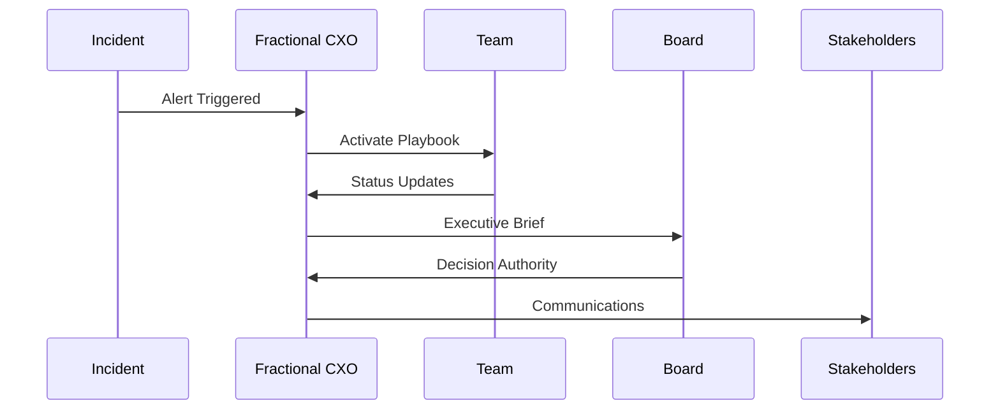
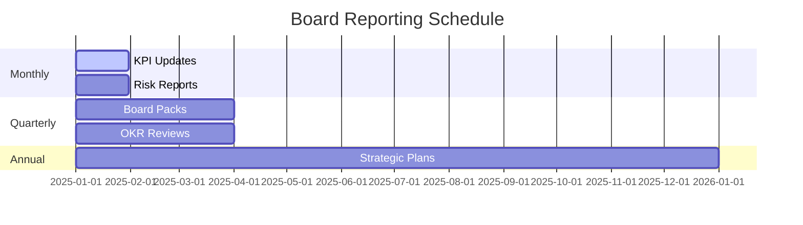
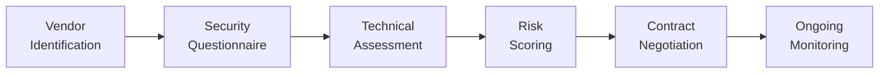
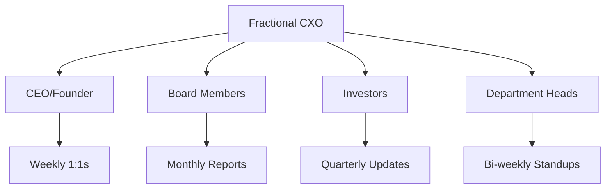

# 🏛️ Fractional Tech CXO Program — Workflows, Quickstart & Deliverables

This document organizes the key **boardroom-ready workflows**, a **quickstart**, **first-week actions**, **deliverables checklist**, and the **assessment rubric** in a clean, GitHub-friendly format.

---

## Table of Contents
- [Boardroom Workflows](#boardroom-workflows)
  - [Risk Assessment Workflow](#risk-assessment-workflow)
  - [Financial Planning Process](#financial-planning-process)
  - [Crisis Management Response](#crisis-management-response)
  - [Decision Framework](#decision-framework)
  - [Board Reporting Cadence](#board-reporting-cadence)
  - [Vendor Assessment Pipeline](#vendor-assessment-pipeline)
  - [Stakeholder Communication Matrix](#stakeholder-communication-matrix)
- [Quickstart](#quickstart)
- [First Week Actions](#first-week-actions)
- [Deliverables Checklist](#deliverables-checklist)
- [Assessment Rubric](#assessment-rubric)
- [License](#license)

---

## Boardroom Workflows

### Risk Assessment Workflow
```mermaid
flowchart TD
  A[Risk Register<br/>Creation] --> B[Cyber Baseline<br/>Assessment]
  B --> C[Vendor Security<br/>Review]
  C --> D[Incident Response<br/>Testing]
  D --> E[Board Risk<br/>Reporting]
  E --> F[Continuous<br/>Monitoring]
````

### Financial Planning Process

```mermaid
flowchart TD
  A[Driver-Based<br/>Model Build] --> B[KPI Scorecard<br/>Design]
  B --> C[OKR Tree<br/>Alignment]
  C --> D[Capital Options<br/>Analysis]
  D --> E[Board Pack<br/>Preparation]
  E --> F[Investor<br/>Updates]
```

### Crisis Management Response



### Decision Framework


### Board Reporting Cadence



### Vendor Assessment Pipeline



### Stakeholder Communication Matrix



---

## Quickstart

```bash
# Clone the repository
git clone https://github.com/your-org/tech-fractional-cxo-program.git
cd tech-fractional-cxo-program

# Create your first artifacts
./scripts/new_artifact.sh governance charter
./scripts/new_artifact.sh risk assessment
./scripts/new_artifact.sh "board pack"

# Review module 1 syllabus
cat syllabus/module1_governance.md
```

---

## First Week Actions

* Complete stakeholder mapping using `tools/governance_charter.md`
* Establish decision rights with `tools/decision_rights_raci.md`
* Begin risk assessment using `tools/cyber_baseline_checklist.md`
* Schedule first board update using `tools/board_pack_template.md`

---

## Deliverables Checklist

### Module 1 — Governance

* [ ] Governance charter approved
* [ ] Decision rights RACI matrix deployed
* [ ] First decision memo published

### Module 2 — Finance

* [ ] Driver-based financial model built
* [ ] KPI scorecard operational
* [ ] Capital options brief completed

### Module 3 — Cyber Risk

* [ ] Risk register populated
* [ ] Baseline security assessment done
* [ ] Incident response playbook tested

### Module 4 — Operating Rhythm

* [ ] 90-day plan executed
* [ ] Board pack template deployed
* [ ] Crisis simulation completed

---

## Assessment Rubric

| Criteria            | Excellent (4)            | Good (3)               | Satisfactory (2)     | Needs Improvement (1)  |
| ------------------- | ------------------------ | ---------------------- | -------------------- | ---------------------- |
| Boardroom Readiness | Investor-grade quality   | Minor revisions needed | Functional but basic | Requires major work    |
| Speed to Value      | < 30 days implementation | 30–60 days             | 60–90 days           | > 90 days              |
| Stakeholder Buy-in  | Unanimous support        | Majority support       | Mixed reception      | Resistance encountered |
| Technical Quality   | Best-in-class frameworks | Industry standard      | Basic compliance     | Below expectations     |

---

## License

Licensed under **DACR-1.1** — see `LICENSE.md` for full terms.
Copyright (c) **2025 Erwin Maurice McDonald**

```

---

If you’d like, I can also turn this into a **multi-file export** (README + CSVs + templates) using the same structure you’ve been using with `#### FILE:` headers.
::contentReference[oaicite:0]{index=0}
```
