# 🏛️ Tech CXO / Fractional CIO Executive Program (SMU CAPE–Inspired)


> **Recommended repo name:** `fractional-tech-cxo-excellence`  
> **One-line value:** Boardroom-focused training and portfolio build for Fractional CIO/CTO/COO leaders—combining strategy, finance, cybersecurity, governance, and operating cadence into a repeatable, investor-credible system.

---

## ⚠️ Note on Affiliation
*“SMU CAPE–inspired”* means we mirror the rigor and executive tone of top programs. This project has **no affiliation** with SMU or any university.

---

## 🔎 Executive Summary
This program turns your repo into a **living portfolio** and training ground for Fractional Tech CXOs. You’ll execute real artifacts—board packs, governance matrices, risk runbooks, funding models, and 90-day transformations—demonstrating that you operate at **boardroom caliber** for startups and scale-ups.

---

## 🎯 Learning Outcomes
By completion, you will be able to:
1. **Govern** early-stage tech with lightweight boards, charters, and operating cadence.  
2. **Model finance** (runway, CAC/LTV, scenario stress tests) to inform strategy.  
3. **Secure & de-risk** with a pragmatic cybersecurity baseline (MFA, Zero Trust, vendor risk).  
4. **Operate** via OKRs/KPIs, executive scorecards, and incident playbooks.  
5. **Communicate** with board-ready briefs, investor updates, and executive narratives.  
6. **Deliver** a portfolio of artifacts that prove Fractional CXO capability.

---

## 🧭 Syllabus (4 Modules)

### Module 1 — Role, Expectations, Organization & Governance
- Fractional CxO mandate; scope vs. authority; advisory vs. delivery  
- Lightweight governance: board/advisory cadence, decision rights, RACI, charters  
- Founder alignment: equity, vesting, term sheets, “stop/go” criteria  
- **Deliverables:** Governance Charter, Decision Rights Matrix, 30-60-90 Onboarding Plan

### Module 2 — Financial Planning & Partnering for Success
- Runway math: burn, CAC/LTV, payback, unit economics; scenario modeling  
- Partnering models: sweat equity, service credits, rev-share; protecting leverage  
- Capital strategy: bootstrap vs. VC vs. non-dilutive; board implications  
- **Deliverables:** Driver-based Financial Model, Capital Options Brief, KPI Tree

### Module 3 — IT, Cybersecurity & Managing Risk
- Lean IT stack: identity, endpoint, cloud policy, vendor selection  
- Security baseline: MFA, least privilege, secrets, SOC2-lite controls; vendor risk  
- Risk program: register, heat-map, playbooks (outage, breach, data loss)  
- **Deliverables:** Cyber Baseline (12-control checklist), Risk Register + Heatmap, Incident Playbook

### Module 4 — Performance, Operating Rhythm & Leadership Excellence
- OKRs/KPIs, executive scorecards, weekly business review (WBR)  
- Board communications: board pack, investor update, funding ask memo  
- Transition paths: scale from fractional to FT or advisor; succession  
- **Deliverables:** Board Pack, Monthly Investor Update, 90-Day Transformation Plan

---

## 🗂 Repository Map

```text
fractional-tech-cxo-excellence/
│
├── README.md
├── syllabus/
│   ├── module1_governance.md
│   ├── module2_finance.md
│   ├── module3_cyber_risk.md
│   └── module4_operating_rhythm.md
│
├── case-studies/
│   ├── founder_conflict.md
│   ├── budget_vs_innovation.md
│   ├── cyber_breach.md
│   └── scaling_ops.md
│
├── tools/
│   ├── fractional_cxo_toolkit.md
│   ├── board_meeting_checklist.md
│   ├── investor_update_template.md
│   └── governance_matrix.md
│
├── simulations/
│   ├── ai_decision_prompts.md
│   └── crisis_wargame.md
│
└── resources/
    ├── leadership_books.md
    ├── startup_finance.md
    └── cybersecurity_mustreads.md
````

---

## 🔧 Working Method (Daily/Weekly)

### A) Daily Execution Loop

```mermaid
flowchart LR
  A["Intake:<br/>objective & constraints"] --> B["Analyze:<br/>data, risks, stakeholders"]
  B --> C["Options:<br/>2–3 viable paths"]
  C --> D["Decision Memo:<br/>one-page brief"]
  D --> E["Action:<br/>tasks, owners, ETA"]
  E --> F["Review:<br/>OKR/KPI update, risks"]
  F --> A
```



### B) Weekly Operating Rhythm (WBR → MBR → Board)


### C) Program Blueprint (Modules → Capstone)


---

## 🧪 Case Studies (HBR-style, startup-focused)

* **Founder Conflict:** Decision rights vs. equity; role clarity; escalation path
* **Budget vs. Innovation:** Tradeoffs under runway pressure; scenario prioritization
* **Cyber Breach at Seed Stage:** MFA gaps, vendor risk, customer comms, legal exposure
* **Scaling Ops:** 10→50 employees; hiring waves; OKR realignment; SOC2-lite roadmap

---

## 🧰 Board-Ready Templates (in `/tools`)

* **Board Pack (Monthly/Quarterly)** — agenda, KPIs, risks, decisions requested
* **Investor Update** — highlights, runway, asks, KPI deltas, hiring, risks
* **Governance Matrix (RACI)** — decision rights, escalation lanes, SLAs
* **Fractional CXO Toolkit** — contract clauses, engagement model, exit criteria

---

## 🧵 Simulations (in `/simulations`)

* **AI Decision Prompts:** “You are the CIO presenting a funding ask…” (auto-generate exec memos)
* **Crisis Wargame:** 60-minute breach/outage tabletop with roles, injects, and after-action review

---

## 📚 Curated Resources (in `/resources`)

* **Leadership:** Kotter, Drucker, Horowitz *The Hard Thing About Hard Things*
* **Finance:** SaaS metrics, CAC/LTV, driver-based models, scenario planning
* **Cyber:** NIST CSF, CIS Controls, vendor-risk playbooks, breach comms

---

## 🧮 Assessment & Portfolio Rubric

| Dimension              | Evidence in Portfolio                                             | Weight |
| ---------------------- | ----------------------------------------------------------------- | :----: |
| Governance & Clarity   | Charter, decision rights, onboarding plan                         |   25%  |
| Financial Rigor        | Driver-based model, KPI tree, scenario brief                      |   25%  |
| Security & Risk        | Baseline controls, risk register, incident playbook               |   25%  |
| Communication & Impact | Board pack, investor update, 90-day plan with measurable outcomes |   25%  |

**Pass bar:** ≥ 80% overall, no category below 60%.

---

## ⚡ Quickstart

```bash
# 1) Create repo
git clone https://github.com/<you>/fractional-tech-cxo-excellence.git
cd fractional-tech-cxo-excellence

# 2) Create your first artifacts
code syllabus/module1_governance.md tools/governance_matrix.md tools/board_meeting_checklist.md

# 3) Start with Module 1 (Governance), then commit your first Board Pack draft
```

**Submission pattern:** Each module yields **named artifacts** (see Deliverables). Push early, iterate often, link to case studies.

---

## 🔐 License

This project uses the **DACR** (Defensive AI Commercial Rights) license. See `LICENSE`.
Avoid committing secrets or private customer data. Use synthetic or redacted examples.

---

## 🧩 Deliverables Checklist (Portfolio)

* Governance Charter & Decision Rights Matrix
* Driver-based Financial Model & KPI Tree
* Risk Register + Heatmap; Incident/Breach Playbook
* Board Pack, Investor Update, 90-Day CXO Plan
* Capstone: **Board Simulation & Funding Ask** (slides + 1-pager)

---

## 📣 Program Credibility

* **Rigor:** Executive-level cadence and artifacts; board-ready writing
* **Practical:** Templates, wargames, decision memos; not lecture notes
* **Portable:** Everything lives in GitHub for shareable proof of capability

---

