# 🏛️ Tech CXO / Fractional CIO Executive Program (SMU CAPE–Inspired)


> **One-line value:** Boardroom-focused training and portfolio build for Fractional CIO/CTO/COO leaders—combining strategy, finance, cybersecurity, governance, and operating cadence into a repeatable, investor-credible system.

---

## ⚠️ Note on Affiliation
*“SMU CAPE–inspired”* means we mirror the rigor and executive tone of top programs. This project has **no affiliation** with SMU or any university.

---

## 🔎 Executive Summary
This program turns your repo into a **living portfolio** and training ground for Fractional Tech CXOs. You’ll execute real artifacts—board packs, governance matrices, risk runbooks, funding models, and 90-day transformations—demonstrating that you operate at **boardroom caliber** for startups and scale-ups.

---

## 🎯 Learning Outcomes
By completion, you will be able to:
1. **Govern** early-stage tech with lightweight boards, charters, and operating cadence.  
2. **Model finance** (runway, CAC/LTV, scenario stress tests) to inform strategy.  
3. **Secure & de-risk** with a pragmatic cybersecurity baseline (MFA, least privilege, vendor risk).  
4. **Operate** via OKRs/KPIs, executive scorecards, and incident playbooks.  
5. **Communicate** with board-ready briefs, investor updates, and executive narratives.  
6. **Deliver** a portfolio of artifacts that prove Fractional CXO capability.

---

## 👥 Who This Is For
Non-traditional leaders and emerging CXOs (no MBA required) entering or leveling up in early-stage tech. Comfort with basic Git is helpful.

---

## 🔧 System Requirements
- Git (2.40+)  
- VS Code (or your editor of choice)  
- Windows **CMD** or **PowerShell** (macOS/Linux: Terminal)  
- Optional: Mermaid preview extension for VS Code

---

## 🧭 Syllabus (4 Core Modules)
> Modules repeat and deepen across 16 weeks. Weeks 1–4 establish foundations; later weeks extend finance, GTM, ops, and capstone.

### Module 1 — Role, Expectations, Organization & Governance
- Fractional CXO mandate; scope vs. authority; advisory vs. delivery  
- Lightweight governance: board/advisory cadence, decision rights, RACI, charters  
- Founder alignment: guardrails, terming, “stop/go” criteria  
- **Deliverables:** Governance Charter, Decision Rights Matrix, 30-60-90 Onboarding Plan

### Module 2 — Financial Planning & Partnering for Success
- Runway math: burn, CAC/LTV, payback, unit economics; scenario modeling  
- Partnering models: sweat equity, service credits, rev-share  
- Capital strategy: bootstrap vs. VC vs. non-dilutive; board implications  
- **Deliverables:** Driver-based Financial Model, Capital Options Brief, KPI Tree

### Module 3 — IT, Cybersecurity & Managing Risk
- Lean IT stack: identity, endpoint, cloud policy, vendor selection  
- Security baseline: MFA, least privilege, secrets, SOC2-lite controls; vendor risk  
- Risk program: register, heat-map, playbooks (outage, breach, data loss)  
- **Deliverables:** Cyber Baseline (12 controls), Risk Register + Heatmap, Incident Playbook

### Module 4 — Performance, Operating Rhythm & Leadership Excellence
- OKRs/KPIs, executive scorecards, weekly business review (WBR)  
- Board communications: board pack, investor update, funding ask memo  
- Transition paths: fractional → full-time/advisor; succession  
- **Deliverables:** Board Pack, Monthly Investor Update, 90-Day Transformation Plan

---

## 🗓 Program Calendar (Illustrative)
| Week | Focus | Core Deliverables |
|---|---|---|
| 1 | Governance Foundations | Charter v1, Decision Rights/RACI, 30-60-90 |
| 2 | Board Comms | Decision Memo, Board Pack Outline, Governance Calendar |
| 3 | Cyber/Risk Baseline | 12 Controls, Risk Register + Heatmap, Playbooks |
| 4 | Finance Drivers | KPI Tree, Driver-Based Model (Runway) |
| 5–8 | Deepening | Scenario stress tests; WBR → MBR; vendor risk program |
| 9–12 | GTM & Ops | Exec scorecards, dashboards, cadence tune-ups |
| 13–16 | Capstone | Board simulation, investor update, transformation plan |

---

## 🗂 Repository Map
```text
tech-fractional-cxo-program/
│
├── README.md
├── Week01/ … Week16/           # daily lessons (Day01..Day07.md per week)
│   └── DayXX.md                # objectives, activity, deliverables, DoD
│
├── governance/                 # charters, decision rights, logs
├── finance/                    # driver models, KPI tree, scenarios
├── security/                   # baselines, identity access policy
├── risk/                       # registers, heatmaps, vendor risk
├── board/                      # decision memos, outlines, talk tracks
├── operations/                 # onboarding, weekly reviews
├── playbooks/                  # breach/outage playbooks
├── case-studies/               # reflections, scenarios
├── assets/                     # images by week (e.g., assets/week01/)
└── tools/                      # checklists, templates
````

---

## 🧩 No-404 Asset Policy

* Use **repo-relative paths** only (e.g., `assets/week01/...`, `Week01/Day01.md`).
* If an asset doesn’t exist yet, write “placeholder” and create an empty file in the path.
* Never paste external links into student deliverables.

---

## 🔧 Working Method — **Boardroom Workflows**

> Diagrams below use `<br/>` inside nodes and render natively on GitHub.

### 1) Program Operating Model — Ecosystem View

```mermaid
flowchart LR
  %% Styling
  classDef org fill:#0b4,color:#fff,stroke:#083,stroke-width:1.2;
  classDef prog fill:#036,color:#fff,stroke:#024,stroke-width:1.2;
  classDef mkts fill:#555,color:#fff,stroke:#333,stroke-width:1.2;
  classDef out  fill:#600,color:#fff,stroke:#400,stroke-width:1.2;

  subgraph ORG["Venture / Client Org"]
    O1["Strategy & OKRs<br/>North Star • Guardrails"]:::org
    O2["Exec Team<br/>Ops • Eng • GTM"]:::org
    O3["Risk & Controls<br/>Register • SLAs"]:::org
  end

  subgraph PROG["This Program (Your Repo)"]
    P1["Syllabus<br/>4 Modules"]:::prog
    P2["Artifacts<br/>Charter • Model • Playbooks"]:::prog
    P3["Reviews<br/>Board Pack • Investor Update"]:::prog
  end

  subgraph MARKET["Stakeholders"]
    S1["Founders • Investors"]:::mkts
    S2["Customers • Partners"]:::mkts
    S3["Advisors • Counsel"]:::mkts
  end

  O1 <---> P1
  O2 <---> P2
  O3 <---> P2
  P3 --> S1
  O2 --> S2
  S3 -. advisory .- O1

  OUT["Outcomes<br/>Better Decisions • Faster Execution • Lower Risk"]:::out
  O1 & O2 & O3 & P1 & P2 & P3 --> OUT
```



### 2) Monthly Governance & Decision Cycle (Sequence)

```mermaid
sequenceDiagram
  autonumber
  participant CXO as Fractional CXO
  participant CH as Chair/Mentor
  participant EX as Exec Team
  participant BD as Board/Investors

  CXO->>CH: Pre-brief<br/>goals • constraints • risks
  CH-->>CXO: Challenge<br/>assumptions • decision memo frame
  CXO->>EX: Options review<br/>owners • costs • ETA
  CXO->>BD: Decision memo<br/>ask • ROI • risk deltas
  BD-->>CXO: Approve/Refine<br/>guardrails • milestones
  CXO->>EX: Execute<br/>plan • budget • KPIs
  Note over CXO,CH: 1:1 coaching • lessons learned • backlog refresh
```



### 3) Strategy-to-Execution Pipeline with Risk & ROI Gates


### 4) OKR Cascade — From North Star to Metrics

```mermaid
flowchart TB
  classDef head fill:#1f2937,color:#fff,stroke:#111;
  classDef node fill:#0b4,color:#fff,stroke:#083;
  classDef met  fill:#036,color:#fff,stroke:#024;

  NS["Company North Star<br/>mission • advantage"]:::head
  O1["Company OKR 1<br/>strategic outcome"]:::node
  O2["Company OKR 2<br/>strategic outcome"]:::node
  D1["Dept OKRs<br/>Eng • GTM • Ops"]:::node
  I1["Initiatives<br/>projects • epics"]:::node
  K1["KPIs & Targets<br/>leading • lagging"]:::met

  NS --> O1 --> D1 --> I1 --> K1
  NS --> O2
```



### 5) Cyber Risk Playbook (State Machine)

```mermaid
stateDiagram-v2
  [*] --> Detect
  Detect: Signals<br/>alerts • peer intel • audits
  Detect --> Triage: Severity assess • scope
  Triage --> Contain: High/Critical
  Triage --> Monitor: Low/Medium
  Contain --> Eradicate: Root cause • vendor actions
  Eradicate --> Recover: Services • data • comms
  Recover --> Learn: Post-mortem • control gaps
  Learn --> [*]
  Monitor --> Learn: Trend review • backlog
```



### 6) Financial Runway Scenario (Driver-Based)

```mermaid
flowchart LR
  classDef drv fill:#0b4,color:#fff,stroke:#083;
  classDef calc fill:#036,color:#fff,stroke:#024;
  classDef out fill:#600,color:#fff,stroke:#400;

  D1["Inputs<br/>ARR • CAC • LTV • Churn"]:::drv --> C1["Model<br/>burn • runway • payback"]:::calc
  D2["Levers<br/>price • mix • hiring plan"]:::drv --> C1
  C1 --> O1["Outputs<br/>runway months • covenants risk"]:::out
  C1 --> O2["Board View<br/>p50 • p95 bands"]:::out
```



### 7) Portfolio Artifact Flow — From Template to Board Pack

```mermaid
flowchart LR
  classDef t fill:#1f2937,color:#fff,stroke:#111;
  classDef a fill:#0b4,color:#fff,stroke:#083;
  classDef r fill:#036,color:#fff,stroke:#024;

  T1["Templates<br/>charter • model • playbooks"]:::t --> A1["Draft Artifacts<br/>repo PRs"]:::a --> R1["Review Cycle<br/>comments • revisions"]:::r --> A2["Approved Artifacts<br/>versioned"]:::a --> P1["Board Pack<br/>decision ready"]:::r
```



### 8) Role & Responsibility Snapshot (RACI-style)

```mermaid
flowchart LR
  classDef role fill:#1f2937,color:#fff,stroke:#111;
  classDef resp fill:#0b4,color:#fff,stroke:#083;

  subgraph Roles
    CXO["Fractional CXO"]:::role
    FD["Founder/CEO"]:::role
    CH["Chair/Mentor"]:::role
    EX["Exec Team"]:::role
    BD["Board/Investors"]:::role
  end

  CXO --> R1["Decision Memos<br/>options • risk • ROI"]:::resp
  CH  --> R2["Challenge • 1:1<br/>cadence • accountability"]:::resp
  EX  --> R3["Execution<br/>owners • KPIs"]:::resp
  FD  --> R4["Vision • Guardrails<br/>talent • budget"]:::resp
  BD  --> R5["Governance<br/>capital • strategy"]:::resp

  R1 --> R3
  R4 --> CXO
  R5 --> CXO
```



### 9) 90-Day Onboarding Timeline (Gantt)


### 10) Commitment Profile (Pie)


---

## ✅ Submission & Review

* Submit weekly: `operations/weekXX_review_and_status.md`
* All artifacts live under their week/module folders (repo-relative).
* Acceptance criteria live in each Day file; **Definition of Done** must be checked before PR.

> **Anti-hallucination guardrail:** Use **“placeholder”** for unknown data. Do **not** invent real company or customer names.

---

## 🧮 Assessment & Portfolio Rubric

| Dimension              | Evidence in Portfolio                                             | Weight |
| ---------------------- | ----------------------------------------------------------------- | :----: |
| Governance & Clarity   | Charter, decision rights, onboarding plan                         |   25%  |
| Financial Rigor        | Driver-based model, KPI tree, scenario brief                      |   25%  |
| Security & Risk        | Baseline controls, risk register, incident playbook               |   25%  |
| Communication & Impact | Board pack, investor update, 90-day plan with measurable outcomes |   25%  |

**Pass bar:** ≥ 80% overall, no category below 60%.

---

## ⚡ Quickstart

```bash
# 1) Clone the repo
git clone https://github.com/emcdo411/tech-fractional-cxo-program.git
cd tech-fractional-cxo-program

# 2) Open and explore
code README.md

# 3) Start with Week01 (Governance), then commit your first Board Pack draft
```

**Submission pattern:** Each module yields **named artifacts** (see Deliverables). Push early, iterate often, link to case studies.

---

## 🔐 License

This project uses the **DACR** (Defensive AI Commercial Rights) license. See `LICENSE`.
Avoid committing secrets or private customer data. Use synthetic or redacted examples.

---

## 🧰 Board-Ready Templates (in `/tools`)

* **Board Pack (Monthly/Quarterly)** — agenda, KPIs, risks, decisions requested
* **Investor Update** — highlights, runway, asks, KPI deltas, hiring, risks
* **Governance Matrix (RACI)** — decision rights, escalation lanes, SLAs
* **Fractional CXO Toolkit** — contract clauses, engagement model, exit criteria

---

## 🧪 Case Studies (in `/case-studies`)

* Founder Conflict — decision rights vs. equity; role clarity; escalation path
* Budget vs. Innovation — tradeoffs under runway pressure; scenario prioritization
* Cyber Breach at Seed Stage — MFA gaps, vendor risk, comms, legal exposure
* Scaling Ops — 10→50 employees; hiring waves; OKR realignment; SOC2-lite roadmap

---

## 🧵 Simulations (in `/simulations`)

* **AI Decision Prompts:** “You are the CIO presenting a funding ask…”
* **Crisis Wargame:** 60-minute breach/outage tabletop with roles, injects, and after-action review

---

## 🧩 Deliverables Checklist (Portfolio)

* Governance Charter & Decision Rights Matrix
* Driver-based Financial Model & KPI Tree
* Risk Register + Heatmap; Incident/Breach Playbook
* Board Pack, Investor Update, 90-Day CXO Plan
* Capstone: **Board Simulation & Funding Ask** (slides + 1-pager)

---

## 📣 Program Credibility

* **Rigor:** Executive-level cadence and artifacts; board-ready writing
* **Practical:** Templates, wargames, decision memos; not lecture notes
* **Portable:** Everything lives in GitHub for shareable proof of capability

---

## 🛣 Roadmap

* **Week05–08:** Finance deep dives, scenario stress tests
* **Week09–12:** GTM & Ops dashboards, exec scorecards
* **Week13–16:** Capstone board simulation & investor update

```
```


