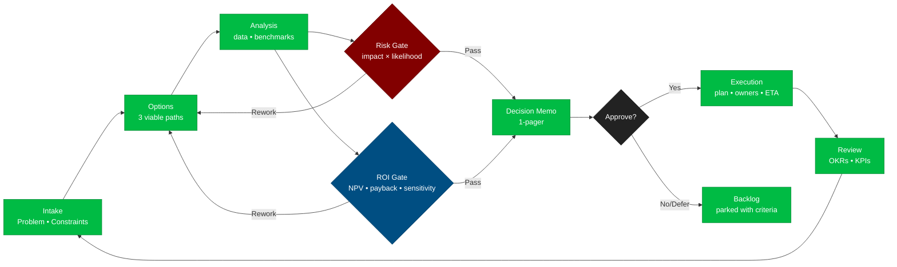
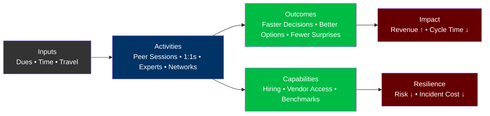
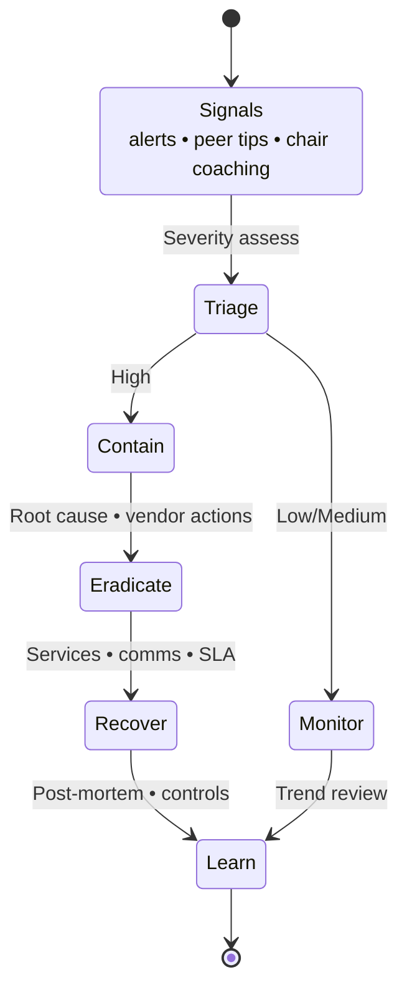
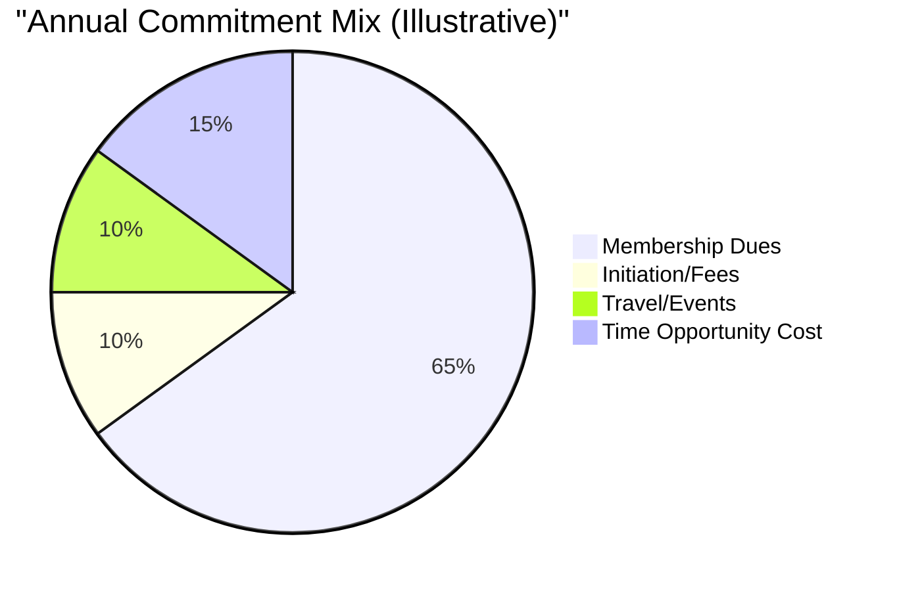
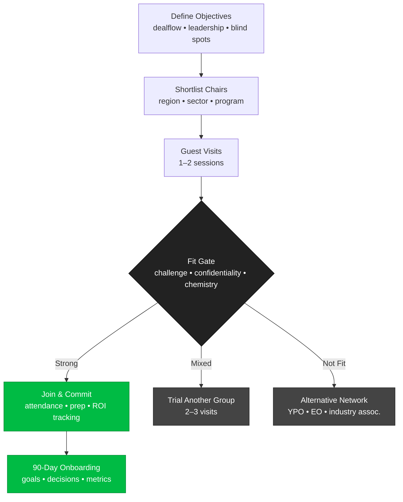
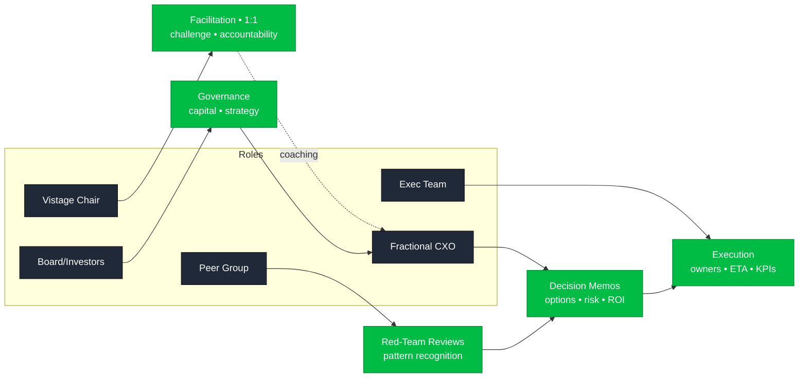
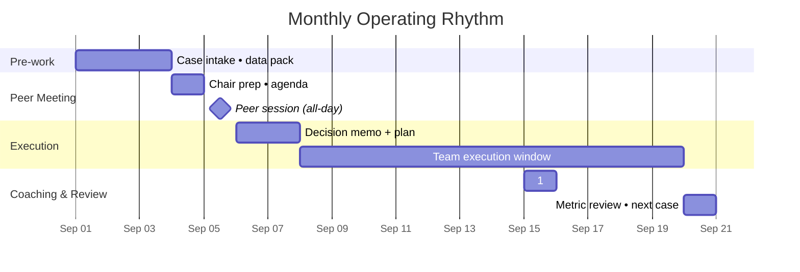

# Vistage — TL;DR for Fractional CXO/CIO/CISO (Executive Brief)


> **Disclaimer:** Independent research; not affiliated with Vistage. Verify specifics with a local Chair.

---

## TL;DR (≈1 minute)
Vistage is a global peer-advisory and executive-coaching network built around monthly confidential groups (≈12–16 leaders), a dedicated Chair (coach), 1:1 sessions, expert speakers, and a private global network. Members report better decisions, faster cycles, and a stronger leadership cadence. Ideal for **fractional CXOs** seeking pattern recognition across industries, board-caliber decision practice, and curated dealflow/vendor networks. :contentReference[oaicite:0]{index=0}

---

## In Five Minutes
- **What it is:** Peer groups + Chair-led facilitation + 1:1 coaching + expert content + global networks. :contentReference[oaicite:1]{index=1}  
- **Scale:** 65+ years in market; 45k+ members across ~40 countries. :contentReference[oaicite:2]{index=2}  
- **Cadence:** Monthly all-day peer session (12–16 non-competing execs) + monthly 1:1 with Chair + optional expert sessions. :contentReference[oaicite:3]{index=3}  
- **Programs:** Chief Executive, Small Business, Key Executive, Trusted Advisor, etc. (good fit for CIO/CTO/CISO via “Key Executive” or “Trusted Advisor” tracks). :contentReference[oaicite:4]{index=4}  
- **Cost:** Pricing varies by program/region; estimates suggest ~$12k–15k/yr plus ≈$2.5k initiation (range varies; confirm locally). :contentReference[oaicite:5]{index=5}

---

## Table of Contents
- [What is Vistage?](#what-is-vistage)
- [How It Works (for CXOs)](#how-it-works-for-cxos)
- [Costs & Time Commitment](#costs--time-commitment)
- [Value for Fractional CIO/CTO/CISO](#value-for-fractional-cioctociso)
- [Risks & Fit Considerations](#risks--fit-considerations)
- [Outcomes & Evidence](#outcomes--evidence)
- [Alternatives & Complements](#alternatives--complements)
- [How to Evaluate a Chair & Group](#how-to-evaluate-a-chair--group)
- [Join Process](#join-process)
- [Diagrams](#diagrams)
- [Comparison Table](#comparison-table)
- [Compliance & Ethics](#compliance--ethics)
- [Citations](#citations)

---

## What is Vistage?
- **Peer advisory groups**: confidential, Chair-facilitated monthly sessions with ~12–16 non-competing executives. :contentReference[oaicite:6]{index=6}  
- **Chair as coach**: seasoned operator who guides the group and provides **1:1** executive coaching. :contentReference[oaicite:7]{index=7}  
- **Thought leadership & research**: expert speakers and research to keep leaders current. :contentReference[oaicite:8]{index=8}  
- **Global scale**: 45k+ members in ~40 countries; 65+ years of history (origin: TEC, 1957). :contentReference[oaicite:9]{index=9}

---

## How It Works (for CXOs)
- **Monthly group**: candid roundtables on strategic decisions, accountability, and blind-spot discovery. :contentReference[oaicite:10]{index=10}  
- **1:1 coaching** with the Chair for targeted goals and obstacle clearing. :contentReference[oaicite:11]{index=11}  
- **Expert sessions & networks**: curated speakers and topical “Networks” for timely peer advice globally. :contentReference[oaicite:12]{index=12}  
- **Group size/composition**: typically 12–16 executives from non-competing firms. :contentReference[oaicite:13]{index=13}

---

## Costs & Time Commitment
- **Pricing policy**: Varies by program/market; official materials state pricing is determined by your qualifying program. **Contact a Chair** for exact figures. :contentReference[oaicite:14]{index=14}  
- **Common estimates** *(independent sources)*:  
  - Initiation fee ≈ **$2,250–$2,500**. :contentReference[oaicite:15]{index=15}  
  - Annual dues range ≈ **$10.5k–$16.5k** (some recent sources cite ~$12k–$15k/yr; CEO groups may be higher). :contentReference[oaicite:16]{index=16}  
- **Time**: 1 full day/month (peer meeting) + 1–2 hours/month (1:1), plus optional events and travel. :contentReference[oaicite:17]{index=17}  
> Treat numbers as **estimates**; confirm with your local Chair.

---

## Value for Fractional CIO/CTO/CISO
- **Pattern recognition** across industries → improves decision speed/quality. (Peer group model) :contentReference[oaicite:18]{index=18}  
- **Board-caliber practice**: pressure-test roadmaps, security investments, AI/automation bets with experienced execs and a Chair. :contentReference[oaicite:19]{index=19}  
- **Network leverage**: curated referrals for talent, vendors, niche experts, and client opportunities via Vistage “Networks.” :contentReference[oaicite:20]{index=20}  
- **Role-fit programs**: “Key Executive” or “Trusted Advisor” can fit fractional tech leaders/consultants. :contentReference[oaicite:21]{index=21}

---

## Risks & Fit Considerations
- **Group quality varies** by Chair and member mix → **visit first**.  
- **Opportunity cost** (time/dues) if you can’t commit to attendance and prep.  
- **Confidentiality expectations** are high; clarify norms before joining. (Confidential peer model) :contentReference[oaicite:22]{index=22}  
- **Mitigation tips**: interview multiple Chairs, guest in 1–2 groups, check stage/industry mix.

---

## Outcomes & Evidence
- Vistage reports decades of coaching and global reach (45k+ members; 65+ years). Outcomes vary by member; treat reported gains as directional, not guaranteed. :contentReference[oaicite:23]{index=23}

---

## Alternatives & Complements
- **YPO** (larger-company focus; CEO/President peer forums).  
- **EO** (entrepreneurs/operators community).  
- **Regional CEO councils / industry associations**.  
Use Vistage for Chair-led structure and SMB/upper-mid market breadth; add an industry association for depth.

---

## How to Evaluate a Chair & Group
1. Chair’s operating background (exits, turnarounds, cyber/IT literacy).  
2. Group composition (stage, size, sectors; non-competing). :contentReference[oaicite:24]{index=24}  
3. Accountability culture (OKRs, follow-ups, red team norms).  
4. Confidentiality expectations & conflict-of-interest guardrails. :contentReference[oaicite:25]{index=25}  
5. Access to relevant Networks (security, data, AI, SaaS). :contentReference[oaicite:26]{index=26}  
6. Guest policy & trial fit.  
7. Travel/time expectations.

---

## Join Process
**Intro call → Guest session → Fit interview with Chair → Terms & onboarding** (program and pricing confirmed locally). :contentReference[oaicite:27]{index=27}

---

## Diagrams

### 1) Operating Model — Fractional CXO ↔ Vistage Ecosystem
```mermaid
flowchart LR
  %% Classes / styling
  classDef core fill:#0b4,color:#fff,stroke:#083,stroke-width:1.2;
  classDef vist fill:#036,color:#fff,stroke:#024,stroke-width:1.2;
  classDef ext  fill:#555,color:#fff,stroke:#333,stroke-width:1.2;
  classDef outc fill:#600,color:#fff,stroke:#400,stroke-width:1.2;

  subgraph ORG["Your Company<br/>(Portfolio Client)"]
    O1["Strategy OKRs<br/>Roadmap"]:::core
    O2["Exec Team<br/>Ops Leads"]:::core
    O3["Risk Register<br/>Controls"]:::core
  end

  subgraph VIST["Vistage Platform"]
    V1["Peer Group<br/>12–16 Execs"]:::vist
    V2["Chair<br/>1:1 Coaching"]:::vist
    V3["Expert Sessions<br/>Playbooks • Benchmarks"]:::vist
    V4["Networks<br/>Talent • Vendors • Deals"]:::vist
  end

  subgraph MARKET["External"]
    M1["Customers"]:::ext
    M2["Vendors • Partners"]:::ext
    M3["Board • Investors"]:::ext
  end

  O1 <---> V1
  O2 <---> V2
  O3 <---> V3
  V4 --- O2
  O2 --> M1
  O2 --> M2
  O1 --> M3

  OUT["Outcomes<br/>Better Decisions • Faster Cycles • Lower Risk"]:::outc
  O1 & O2 & O3 --> OUT
  V1 & V2 & V3 & V4 --> OUT
````

### 2) Monthly Governance & Decision Cycle (Sequence)

```mermaid
sequenceDiagram
  autonumber
  participant CXO as Fractional CXO
  participant CH as Vistage Chair
  participant PG as Peer Group
  participant ET as Exec Team
  participant BD as Board/Investors

  CXO->>CH: Set monthly goals<br/>key decisions • risks
  CH-->>CXO: Pre-work framing<br/>decision memo prompts
  CXO->>PG: Present case<br/>options • constraints • ask
  PG-->>CXO: Red-team critique<br/>assumptions • blind spots
  CXO->>CH: 1:1 coaching<br/>commitments • metrics
  CXO->>ET: Execute plan<br/>owners • ETA • budget
  CXO->>BD: Update pack<br/>OKRs • ROI • risk deltas
  Note over CXO,CH: Close the loop<br/>capture lessons • refresh backlog
```

### 3) Decision Pipeline with Risk & ROI Gates (Stage-Gated)



### 4) Value Realization Map (Inputs → Activities → Outcomes → Impact)



### 5) Risk Escalation Playbook (State-Machine)



### 6) Cost & Commitment Profile (Pie)



### 7) Join Decision — Multi-Path Evaluation



### 8) Role & Responsibility Snapshot (RACI-style)



### 9) Operating Rhythm Timeline (Month View)



---

## Comparison Table

| Network     | Typical Members                   | Cadence              | Coaching      | Cost (public/est.)                                                      | Distinctive Edge                                         |
| ----------- | --------------------------------- | -------------------- | ------------- | ----------------------------------------------------------------------- | -------------------------------------------------------- |
| **Vistage** | CEOs, owners, key execs; advisors | Monthly groups + 1:1 | Chair-led     | Not publicly listed; est. \~\$12k–15k/yr + \~\$2.5k initiation (varies) | Structured Chair model; SMB/UMM breadth; global Networks |
| **YPO**     | CEOs/Presidents of larger firms   | Regular forums       | Forum-style   | Varies by chapter                                                       | Global CEO peer network                                  |
| **EO**      | Founders/operators                | Regular forums       | Moderator-led | Varies by chapter                                                       | Entrepreneur-centric community                           |

*(Use each organization’s site for current pricing and criteria.)*

---

## Compliance & Ethics

* Respect confidentiality; avoid client-identifiable details. (Peer groups are confidential by design.) (\[Vistage]\[1])
* Follow antitrust and conflict-of-interest guidelines; clarify vendor/solicitation rules with your Chair.

---

## Citations

* Vistage approach & cadence; peer group size; elements: (\[Vistage]\[2])
* 1:1 coaching description: (\[Vistage]\[3])
* Members & countries; longevity: (\[Vistage]\[4])
* Home page stats & reach: (\[Vistage]\[5])
* Programs (Key Executive, Trusted Advisor): (\[Vistage]\[6])
* Networks description: (\[Vistage]\[7])
* Confidentiality norms: (\[Vistage]\[1])
* Pricing policy (not listed; program-dependent): (\[Vistage]\[8])
* Independent cost estimates (initiation + annual dues): (\[Long Angle]\[9], \[First Page Sage]\[10], \[FounderGroups Blog]\[11])

```

[1]: https://vistage.co.uk/membership/peer-advisory-groups/?utm_source=chatgpt.com "Peer Advisory Groups"
[2]: https://www.vistage.com/membership/our-approach/?utm_source=chatgpt.com "Peer Advisory Groups"
[3]: https://www.vistage.com/membership/member-experience-one-to-one-coaching/?utm_source=chatgpt.com "One-to-One Business Leadership Coaching"
[4]: https://www.vistage.com/about-vistage/what-is-vistage/?utm_source=chatgpt.com "What is Vistage?"
[5]: https://www.vistage.com/?utm_source=chatgpt.com "Vistage: The World's Largest Executive Coaching Organization"
[6]: https://www.vistage.com/membership/programs/key-executive-program/?utm_source=chatgpt.com "Key Executive Program: C-Suite Coaching"
[7]: https://www.vistage.com/vistage-networks/?utm_source=chatgpt.com "Vistage Networks"
[8]: https://www.vistage.com/membership/programs/?utm_source=chatgpt.com "Executive Coaching Services & Leadership Programs"
[9]: https://www.longangle.com/blog/vistage-vs-ypo?utm_source=chatgpt.com "Vistage vs. YPO (vs. Long Angle): Which is Right For You?"
[10]: https://firstpagesage.com/uncategorized/vistage-worth-honest-review/?utm_source=chatgpt.com "Is Vistage Worth It? An Honest Review"
[11]: https://blog.foundergroups.com/vistage-membership-requirements-and-cost/?utm_source=chatgpt.com "Vistage Membership Requirements and Cost"
```
