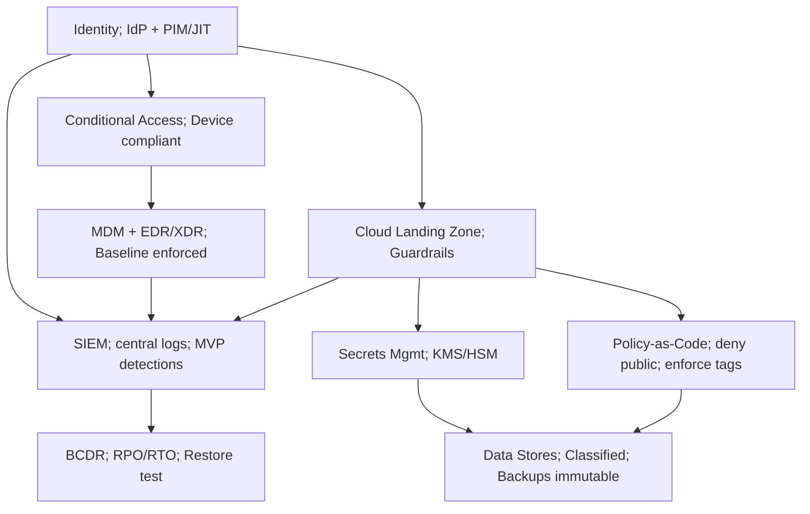

## Day01 — Zero-Trust Lean IT Stack Baseline (CXO Edition)

### Objectives
- Define a **12-month, zero-trust reference stack** for a seed→Series A team that balances speed and risk.
- Codify **identity-first** controls (phishing-resistant MFA, PIM/JIT, JML) and **device posture** (MDM + EDR/XDR).
- Stand up a **cloud landing zone with guardrails** (org/account structure, IAM boundaries, network egress, secrets mgmt, IaC + policy-as-code).
- Establish **data classification + backup immutability** (3-2-1-1-0), RPO/RTO targets, and a restore test plan.
- Centralize **logging/telemetry** (IdP, MDM/EDR, cloud audit) with minimal viable detections and retention.
- Set **vendor/SaaS intake** rules (SSO/SAML, SCIM, least privilege) and a lightweight risk record.

### Lesson Summary
Build a **Minimum Lovable Platform (MLP)**: identity as the new perimeter, devices gate access, cloud is codified, data is classified and recoverable, and logs tell the story. Prefer **managed services**, enforce **least privilege**, and encode policy as code from day one.

### Activities (do in order)
1. **Map Business→Control**  
   - Identify top 5 business capabilities (e.g., payments, customer data, analytics).  
   - For each, assign a primary control owner (RACI: Responsible/Accountable).

2. **Identity & Access**  
   - Choose IdP (e.g., Entra ID/Okta). Draft **Conditional Access**: require **FIDO2/WebAuthn** for admins; block legacy MFA.  
   - Define **PIM/JIT** windows, approval chain, and **break-glass** (2 accounts, offline, monitored, 90-day rotation).  
   - Document **JML** (joiner-mover-leaver) flow with SCIM provisioning.

3. **Endpoint Security**  
   - Baseline **MDM** (Intune/Jamf): disk encryption, screen lock, OS patch SLA.  
   - Ensure **EDR/XDR** coverage ≥95% and enforce “device compliant” as a condition for admin elevation.

4. **Cloud Landing Zone & Guardrails**  
   - Organize accounts/subscriptions/projects; define **prod vs non-prod** boundaries.  
   - Enable **KMS/HSM** keys per domain; select **secrets mgmt** (Vault/SM/KeyVault).  
   - Add **policy-as-code**: deny public buckets, deny 0.0.0.0/0, enforce tags, restrict regions.

5. **Data & Backups**  
   - Classify data (Public/Internal/Confidential/Restricted).  
   - Set **RPO** (≤24h) and **RTO** (≤8h) for top 3 data stores; enable **object lock/immutability** 7–30 days.  
   - Schedule one **restore test** this sprint (even if synthetic).

6. **Logging & Detections**  
   - Centralize logs to SIEM (e.g., Splunk/Chronicle/Defender).  
   - Onboard IdP sign-ins, CA decisions, MDM/EDR alerts, cloud audit logs.  
   - Create MVP detections: **impossible travel**, **MFA fatigue**, **privilege elevation**, **public resource creation**.

7. **SaaS/Vendor Intake**  
   - Require **SSO + SCIM** for tier-1 SaaS; document least-privilege roles.  
   - Open a **vendor risk record** (data type, region, controls, owner).

### Deliverables
- **security/it_stack_baseline.md**  
  Sections: Identity; Endpoint; Cloud (Landing Zone & Network); Data & Backups; Logging & Detections; Vendor/SaaS; BCDR.
- **security/policies/conditional_access.yml** (admin MFA = FIDO2; device-compliant required; session timeouts; risk-based prompts)
- **security/policies/pam_break_glass.md** (who, when, alerting, expiry, rotation)
- **infra/policy-as-code/guardrails.rego** (or `sentinel.hcl`) — deny public storage; block 0.0.0.0/0; enforce tags; approved regions
- **ops/raci_it_stack.csv** (capability → control → RACI)
- **dr/dr_runbook_skeleton.md** (RPO/RTO chart; comms tree; restore checklist)
- **diagrams/stack_architecture.mmd** (Mermaid diagram of control flow)

### Acceptance & QA (evidence-based)
- **Identity:** FIDO2 required for all admin roles; legacy MFA blocked; **PIM/JIT ≤ 1h**; 2 break-glass accounts with alerting; **JML** flow + owners documented.  
- **Endpoint:** MDM baseline applied; full-disk encryption enforced; EDR ≥95% coverage; patch SLA published; device compliance gates admin elevation.  
- **Cloud:** Guardrails enforce **no public storage** and **no 0.0.0.0/0**; secrets scanning on; IaC repo exists with PR checks.  
- **Data/Backups:** Classification rubric approved; top 3 stores tagged; immutability enabled; RPO/RTO targets stated and a restore test **scheduled**.  
- **Logging:** SIEM connected; IdP/MDM/EDR/cloud logs flowing; 4 MVP detections active; 12-month hot / 7-year cold retention documented (adjust as needed).  
- **Vendor:** Tier-1 SaaS behind SSO/SCIM; risk record opened; owner assigned.  
- **Governance:** Two **ADRs** (architecture decision records) committed for IdP and SIEM choices; exceptions documented via QRD.

### Metrics (start tracking this week)
- **Phish-resistant MFA adoption %** (admins; all users)  
- **Privileged minutes** used per month (target ↓)  
- **MDM/EDR coverage %** (target ≥95%)  
- **Policy violations/week** (public resource, open SG)  
- **Restore test MTTR** (target ≤ 8h)  
- **Log source coverage %** (IdP, endpoints, cloud)

### Timebox
- **Core:** ⏱ 60 minutes (capture decisions, draft policies, commit guardrails)  
- **Stretch:** +30 minutes (wire one detection, schedule restore test, open vendor record)

### (Optional) Architecture Sketch (Mermaid)

::contentReference[oaicite:0]{index=0}
```
