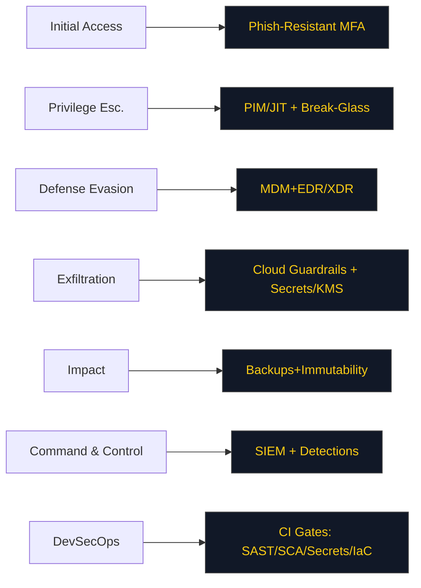

## Day02 — Cybersecurity Baseline: Twelve Controls (CXO Edition)

### Objectives
- Define a **12-control minimum** that materially reduces risk for a seed → Series A org within 90 days.
- Assign **clear ownership, tests, and evidence** for each control; wire into a weekly ops review.
- Map controls to **threats & MITRE ATT&CK** tactics; track leading indicators (coverage, drift) and lagging outcomes (MTTD/MTTR).

### Lesson Summary
A short, enforced control set beats a long, unenforced wish list. Make identity the perimeter, device posture the gate, cloud guardrails the default, and recovery + detection non-negotiable. Each control ships with **(1) owner, (2) policy-as-code or config, (3) test, (4) evidence artifact, (5) metric**.

---

### The Twelve (with Why, Test, Evidence, Metric)

1) **Phishing-Resistant MFA (Admins & High-Risk Apps)**
   - **Why:** Neutralize credential replay / MFA fatigue.
   - **Test:** Attempt legacy OTP on admin; expect **deny**.
   - **Evidence:** IdP policy screenshot & sign-in logs.
   - **Metric:** **% Admins on FIDO2/WebAuthn** (target ≥ 95%).

2) **Privileged Access Management (PIM/JIT) + Break-Glass**
   - **Why:** Shrink standing privilege window; ensure emergency access.
   - **Test:** Elevate to Global Admin; requires approval; auto-revoke ≤ 60 min.
   - **Evidence:** PIM request log; break-glass rotation proof.
   - **Metric:** **Privileged minutes/month** (trend ↓).

3) **MDM + EDR/XDR (Device Compliance Gates Access)**
   - **Why:** Block unmanaged/compromised endpoints.
   - **Test:** Unenrolled laptop tries admin portal; blocked by CA.
   - **Evidence:** MDM compliance report; EDR coverage export.
   - **Metric:** **EDR/MDM coverage %** (target ≥ 95%).

4) **Patch & Vulnerability Mgmt (SLA by Severity)**
   - **Why:** Close known holes fast.
   - **Test:** Random CVE sample → verify patch within SLA (e.g., Critical ≤ 7 days).
   - **Evidence:** Scanner report; change ticket.
   - **Metric:** **% Critical vulns within SLA**.

5) **Email & Domain Protections (DMARC/DKIM/SPF + Anti-Phish)**
   - **Why:** Reduce spoofing & business email compromise.
   - **Test:** External spoof attempt blocked; DMARC at **p=reject**.
   - **Evidence:** DMARC record; email security policy export.
   - **Metric:** **DMARC enforcement** (reject) + **phish click rate**.

6) **Cloud Landing Zone Guardrails (Policy-as-Code)**
   - **Why:** Prevent misconfig at creation time.
   - **Test:** Try to create public bucket / 0.0.0.0/0 SG; policy denies.
   - **Evidence:** Rego/Sentinel policy; CI policy test log.
   - **Metric:** **Policy violations/week** (trend ↓).

7) **Secrets & Key Mgmt (KMS/HSM, Rotation, No Secrets in Code)**
   - **Why:** Contain impact of leaks; enable cryptographic hygiene.
   - **Test:** Secret scanner on repos; rotation age ≤ target (e.g., 90 days).
   - **Evidence:** Secret scanning SARIF; KMS rotation log.
   - **Metric:** **Secrets with rotation age ≤ policy**.

8) **Data Protection & Backups (3-2-1-1-0 + Immutability)**
   - **Why:** Ransomware/ops error resilience.
   - **Test:** Restore drill for top data store meets **RPO/RTO**.
   - **Evidence:** Restore runbook output; immutable snapshot config.
   - **Metric:** **Restore MTTR** (target ≤ 8h for Tier-1).

9) **Logging & Telemetry to SIEM (MVP Detections)**
   - **Why:** See, detect, respond.
   - **Test:** Generate “impossible travel” and “privilege elevation” events → alert within ≤ 5 min.
   - **Evidence:** SIEM rule export; alert timeline.
   - **Metric:** **MTTD** for top detections; **log source coverage %** (IdP, endpoints, cloud).

10) **Secure SDLC (CI Checks: SAST, SCA, Secrets, IaC Policy)**
    - **Why:** Shift-left risk; block bad builds.
    - **Test:** Introduce known secret / open SG in PR; CI fails.
    - **Evidence:** CI pipeline config; failed job logs.
    - **Metric:** **% builds passing all gates**.

11) **SaaS/Vendor Intake (SSO/SAML + SCIM + Risk Record)**
    - **Why:** Third-party blast radius control.
    - **Test:** New Tier-1 SaaS requires SSO; account created via SCIM; least-privilege role applied.
    - **Evidence:** SSO/SCIM config; vendor risk entry.
    - **Metric:** **% Tier-1 SaaS behind SSO/SCIM**.

12) **Incident Readiness (Runbooks, On-Call, Tabletop)**
    - **Why:** Speed + clarity under stress.
    - **Test:** 30-min tabletop for breach/outage; page on-call; comms template used.
    - **Evidence:** After-action report; paging logs.
    - **Metric:** **MTTR P1**; **playbook freshness** (≤ 90 days).

---

### Activity
- Populate the **12-Control Checklist** with **Owner, Status (Now/Next/Done), Test, Evidence, Metric**.
- For **Controls 1–3 & 6** (identity, privileged, device, cloud guardrails), run the tests **today** and attach artifacts.
- Open issues for any failing tests with **due dates** and **RACI**.

#### Control Checklist (starter)
| # | Control | Why | Owner | Status | Test | Evidence | Metric |
|---|---------|-----|-------|--------|------|----------|--------|
| 1 | Phish-Resistant MFA | Stop replay/fatigue | SecEng | Now | Legacy OTP login → deny | IdP logs | Admin FIDO2 % |
| 2 | PIM/JIT + Break-Glass | Minimize standing privilege | IT Ops | Now | JIT elevation ≤ 60m | PIM logs | Privileged minutes |
| 3 | MDM + EDR/XDR | Block unmanaged | EUC | Now | Unenrolled → blocked | MDM/EDR reports | Coverage % |
| 4 | Patch/Vuln Mgmt | Close known holes | IT Ops | Next | CVE SLA sample | Scanner export | % within SLA |
| 5 | Email/DMARC | Reduce spoof/BEC | SecOps | Next | DMARC p=reject | DNS + policy | Phish rate |
| 6 | Cloud Guardrails | Prevent misconfig | Cloud | Now | Public bucket denied | Rego tests | Violations/week |
| 7 | Secrets/KMS | Contain leaks | Platform | Next | Repo secret → fail | SARIF + KMS | Rotation age |
| 8 | Backups/Immut. | Ransomware ready | SRE | Next | Restore meets RPO/RTO | Runbook log | MTTR |
| 9 | SIEM + Detections | Detect/respond | SecOps | Next | Alerts ≤ 5 min | SIEM rules | MTTD |
| 10 | Secure SDLC | Shift-left | Eng | Next | Open SG PR → fail | CI logs | % pass |
| 11 | SaaS/Vendor | Third-party risk | Procurement | Next | SSO/SCIM enforced | Risk record | % SSO/SCIM |
| 12 | IR Playbooks | Speed under stress | SecOps | Now | 30-min tabletop | AAR | MTTR P1 |

---

### Deliverables
- **File:** `security/cyber_baseline_12_controls.md` (table above completed).
- **Evidence bundle:** `evidence/day02/`  
  - `idp_policy.png`, `pim_log.csv`, `edr_coverage.csv`, `rego_tests.txt`, `dmarc_record.txt`, `restore_report.md`, `siem_rules.yml`, `ci_gate.yml`, `vendor_risk.csv`, `tabletop_aar.md`.
- **Metrics sheet:** `metrics/security_kpis.csv` (columns: KPI, Owner, Target, Current, Trend).
- **RACI:** `ops/raci_controls.csv` (Control → R, A, C, I).
- **Exceptions register:** `risk/exceptions.md` (time-boxed; compensating controls).

---

### Acceptance & QA (evidence-based)
- All **12 controls** have **named owners**, tests, and at least one **uploaded evidence artifact**.
- **Controls 1, 2, 3, 6**: tests executed **today**; screenshots/logs attached; any failures have tickets with due dates.
- **At least three controls** in **Done** with metrics captured (not just policy docs).
- **Metrics sheet** contains initial readings for: Admin FIDO2 %, Privileged minutes, EDR coverage %, Policy violations/week, Restore MTTR, MTTD, % Tier-1 SaaS on SSO/SCIM.
- **Two ADRs** (IdP & SIEM) committed; any exceptions documented and time-boxed.

---

### Timebox
- **Core (⏱ 75 min):** Fill table, run tests for 1/2/3/6, capture artifacts, open tickets for gaps.
- **Stretch (+30 min):** Wire one SIEM detection end-to-end; run a 15-min tabletop; add CI gate for secrets.

---

### (Optional) Control→Threat Map (Mermaid)

::contentReference[oaicite:0]{index=0}
```

