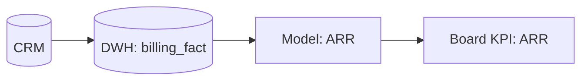

# Week05 — Day02: Data Contracts, Quality SLOs & Lineage (CXO Edition)

## Objectives
- Author **data contracts** (schema, semantics, SLAs) for critical tables powering the Board pack.  
- Define **Quality SLOs** (freshness, completeness, accuracy) and alerting.  
- Publish a **lineage map** from source → model → KPI to enable trust and audits.

## Lesson Summary
Trustworthy KPIs require explicit contracts and observable pipelines. Lock definitions, owners, and SLOs — and make breakage visible.

## Activities (90 min)
- **Identify critical tables (15m):** Top 5 that feed Board KPIs.  
- **Write contracts (40m):** YAML + owners + change policy.  
- **Set SLOs (20m):** Freshness/completeness/accuracy with thresholds & alert routes.  
- **Draw lineage (15m):** Source → Transform → KPI with responsible teams.

## Deliverables
- `data/contracts/arr.yml`, `ndr.yml`, `gross_margin.yml`, `nps.yml`, `incidents_p1.yml`  
- `data/quality_slo.md` (targets, thresholds, paging policy)  
- `data/observability_runbook.md` (who triages what, when)  
- `data/lineage_map.mmd` (Mermaid graph)

## Acceptance & QA
- **5 contracts** merged; each names **owner, schema, constraints, SLO, change process**.  
- **3 SLO monitors** live with alert routes (on-call + Slack/email).  
- Lineage covers **end-to-end** for each KPI in the Board pack.

---

## Contract (YAML excerpt)
```yaml
name: arr
owner: fp&a
schema:
  customer_id: string!    # not null
  month: date!
  acv: decimal(12,2)!
slo:
  freshness_minutes: 30
  completeness_pct: 99.5
  accuracy_checks:
    - "sum(acv) reconciles to GL within 1%"
change_policy:
  notify: fp&a, data-eng, audit
  approval: data-governance-committee
````

## Lineage (Mermaid excerpt)



```
::contentReference[oaicite:0]{index=0}
```

