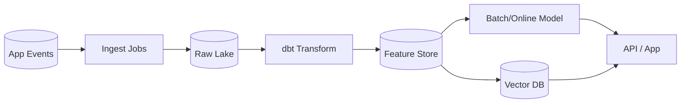

# Week07 — Day02: Data Contracts, Lineage & Observability (Production-Grade)

*Save as:* `wk07/day02_data_contracts_lineage_observability.md`

> **CXO Lens (Deloitte-grade):** Private AI is only as trustworthy as its **data plumbing**. Today we turn pipelines into **auditable assets** with contracts, lineage, deletion proofs, and SLOs—so issues page **us** before they page the **CFO** (or the regulator).

---

## Why this matters (board rationale)

* **Trust-by-design:** Contracts + lineage + proofs = a defensible chain of custody for every model output.
* **Cost control:** Early anomaly detection avoids wasteful reprocessing, LLM re-prompts, and bad decisions at scale.
* **Regulatory readiness:** You can prove *what data* fed *which model* *when*, and you can **forget** data on demand.

---

## Target outcomes (this week)

* **100%** of Tier-1 datasets & vector indexes have **signed data contracts** (schema, SLAs, owners).
* **≥95%** lineage coverage for Tier-1 flows from **source → feature → model → product** (stored & queryable).
* **SLOs live** for freshness, completeness, accuracy, and **model/data drift**, with on-call & runbooks.
* **Deletion proof SLA ≤ 72h** with **immutable artifacts** (request → propagation → confirmation).

---

## Core definitions (tight)

* **Data Contract:** A *versioned* agreement between data producer & consumer: schema + rules + SLAs + owners + change policy.
* **Lineage:** End-to-end record of where data came from, how it was transformed, and where it went—captured per run.
* **SLO/SLI:** Objectives (SLOs) and the concrete measurements (SLIs) that prove we’re meeting them.
* **Deletion Proof:** End-to-end evidence that a subject’s data was located and removed across all replicas/derivatives.

---

## Anti-patterns we’re killing

* “We’ll document later.” → No contract, no production.
* Silent schema changes. → Breaking change policy enforced in CI/CD.
* Vanity dashboards. → Every chart tied to **owners**, **alerts**, and **runbooks**.

---

## Activities (⏱ 75–90 minutes)

### 1) Contract Drafting (25m)

* Identify **Tier-1 assets** (board KPIs, safety-critical features, vector stores).
* For each: define **schema**, **allowed ranges**, **null rules**, **PII class**, **SLA**, **owner**, **on-call**.
* Publish to `wk07/data_contracts/*.yaml` and register in repo; protect with CI checks.

### 2) Lineage Map (20m)

* Document **source → transform → feature store → vector DB → model → product**.
* Capture job/run metadata (code ref, commit, container image, runtime params).
* Export to `wk07/lineage/graph.md` and persist events to your lineage backend.

### 3) SLO Design (20m)

* Choose SLIs for **freshness, completeness, accuracy**, and **drift** (data + model).
* Define targets & **error budgets**; wire alerts to `#data-oncall` and **pager rotation**.
* Create `wk07/observability/slo_catalog.md` + a simple Grafana/Looker board.

### 4) Deletion Proof Flow (10–25m)

* Define intake (API/form), identity resolution, **propagation plan** (OLTP, lake, features, vectors, backups).
* Produce **artifact JSON** with timestamps, IDs, scope, and verification hash.
* Document SOP: `wk07/privacy/deletion_proof_flow.md`.

---

## Deliverables

* `wk07/data_contracts/*.yaml` — one per table/stream/vector index
* `wk07/lineage/graph.md` — lineage diagram + evidence links
* `wk07/observability/slo_catalog.md` — SLOs, SLIs, thresholds, owners
* `wk07/privacy/deletion_proof_flow.md` — step-by-step SOP + artifact template
* `wk07/runbooks/alerts.md` — who gets paged, what to do, rollback steps

---

## Acceptance & QA (evidence-based)

* **Contracts** list **owners & on-call**, and are enforced in CI (no breaking change merges).
* **SLOs live** (dashboards & alerts firing from real probes; dry-run proof).
* **Deletion Proof** run end-to-end on a dummy subject; artifact produced ≤72h.

---

## Templates & Examples

### A) Data Contract (YAML)

```yaml
name: customer_events_v1
version: 1.2.0
owner: data-platform@company.com
on_call: "#data-oncall"
classification: pii-low
residency: us-only
retention_days: 365
encryption: at_rest:+in_transit

schema:
  customer_id: {type: string, required: true}
  event_ts:    {type: timestamp, required: true}
  event_type:  {type: enum, allowed: [view, add_to_cart, purchase], required: true}
  amount_usd:  {type: float, min: 0.0, required: false}

slos:
  freshness_minutes: {target: 15, alert: "> 20"}
  completeness_pct: {target: ">= 99.5%", alert: "< 99.0%"}
  accuracy_rules:
    - rule: "amount_usd >= 0"
    - rule: "event_type in [view, add_to_cart, purchase]"

change_policy:
  breaking_change_notice_days: 14
  deprecation_window_days: 30
  contact: product-analytics@company.com

privacy:
  deletion_propagation:
    - "features/customer_profile"
    - "vectors/customer_semantic"
    - "raw_lake/clickstream"
  audit_log_topic: "audit.deletion"
```

---

### B) Lineage (Mermaid + OpenLineage fields)



*Event fields to capture per run:*

* `job.name`, `job.namespace`, `run.id`, `run.facets` (git sha, image tag)
* `inputs/outputs` (dataset URIs), `columnLineage`, `processingTime`, `rowCounts`

---

### C) SLO Catalog (snippet)

| SLO                         | SLI (how measured)                      | Target   | Alert Threshold  | Owner             |
| --------------------------- | --------------------------------------- | -------- | ---------------- | ----------------- |
| Freshness (events)          | `now - max(event_ts)` minutes           | ≤ 15 min | > 20 min (5 min) | Data Platform     |
| Completeness (events/day)   | `ingested/expected`                     | ≥ 99.5%  | < 99.0% (10 min) | Data Platform     |
| Accuracy (amount\_usd rule) | % rows passing rule set                 | ≥ 99.9%  | < 99.7% (15 min) | Data Quality Lead |
| Vector sync lag             | `max(created_ts) - max(vectorized_ts)`  | ≤ 10 min | > 15 min (5 min) | ML Platform       |
| Model drift (PSI)           | Population Stability Index vs. baseline | ≤ 0.2    | > 0.25 (daily)   | MLOps             |
| Groundedness (eval)         | % answers with valid citations          | ≥ 98%    | < 96% (hourly)   | AI Safety Board   |

---

### D) Alert Runbook (excerpt)

* **Trigger:** Freshness > 20 min
* **Triage:** Check upstream ingest job health → late partition? → provider outage?
* **Fix:** Rerun job with `--from-latest-success` → backfill missing partitions
* **Verify:** Freshness SLI back ≤ 15 min; post-mortem in `#data-postmortems` within 24h

---

### E) Deletion Proof — SOP & Artifact

**SOP (high level):**

1. **Intake:** Subject submits request (portal/API). Generate `req_id`.
2. **Resolve:** Map identifiers (email, device\_id, customer\_id) via ID graph.
3. **Propagate:** Execute deletion jobs across OLTP, lake, features, vectors, **and** backups (per policy).
4. **Verify:** Re-query each system; compute verification hash (dataset,count,timestamp).
5. **Publish:** Write immutable artifact; notify subject.

**Artifact (JSON):**

```json
{
  "req_id": "DEL-2025-09-07-0183",
  "subject_ids": {"email": "user@example.com", "customer_id": "c_49102"},
  "submitted_at": "2025-09-06T18:22:10Z",
  "completed_at": "2025-09-07T09:05:41Z",
  "systems": [
    {"name": "oltp_customers", "status": "deleted", "rows": 3, "ts": "2025-09-06T19:02:11Z"},
    {"name": "lake/clickstream", "status": "tombstoned", "partitions": ["2025-09-01"], "ts": "2025-09-06T20:45:09Z"},
    {"name": "feature_store/customer_profile", "status": "deleted", "rows": 1, "ts": "2025-09-06T21:00:02Z"},
    {"name": "vector_db/customer_semantic", "status": "deleted", "ids": ["v_9213","v_9214"], "ts": "2025-09-06T21:12:44Z"}
  ],
  "verification_hash": "sha256:6a0f…b912",
  "retention_policy": "artifact retained 3 years"
}
```

---

### F) Accuracy/Drift Checks (examples)

**SQL (accuracy):**

```sql
SELECT
  SUM(CASE WHEN amount_usd < 0 THEN 1 ELSE 0 END) AS neg_amount_rows,
  COUNT(*) AS total_rows
FROM customer_events_v1
WHERE event_ts >= DATEADD('hour', -1, CURRENT_TIMESTAMP);
```

**Python (simple PSI drift):**

```python
import numpy as np

def psi(expected, actual, bins=10):
    expected_perc, _ = np.histogram(expected, bins=bins, range=(np.min(expected), np.max(expected)))
    actual_perc, _   = np.histogram(actual,   bins=bins, range=(np.min(expected), np.max(expected)))
    expected_perc = expected_perc / np.sum(expected_perc)
    actual_perc   = actual_perc   / np.sum(actual_perc)
    expected_perc = np.where(expected_perc == 0, 1e-6, expected_perc)
    actual_perc   = np.where(actual_perc   == 0, 1e-6, actual_perc)
    return np.sum((expected_perc - actual_perc) * np.log(expected_perc / actual_perc))
```

---

## Governance & RACI (snapshot)

| Workstream              | R (Doer)      | A (Accountable)  | C (Consulted)        | I (Informed) |
| ----------------------- | ------------- | ---------------- | -------------------- | ------------ |
| Data contracts (Tier-1) | Data Platform | Head of Data     | Security, Product    | ELT          |
| Lineage instrumentation | MLOps         | Head of ML Plat. | Data Platform, Eng   | ELT          |
| Observability SLOs      | Data Quality  | CTO              | Finance, Product     | Org          |
| Deletion proof program  | Privacy Lead  | CISO             | Legal, Data Platform | Org          |

---

## Guardrails & CI gates

* **No contract, no prod:** Pipelines without a signed contract cannot deploy.
* **Schema change gate:** Breaking changes require version bump + 14-day notice.
* **Lineage required:** Jobs fail CI if lineage events are missing.
* **SLO breach policy:** Auto-throttle downstream consumers if accuracy/drift SLOs are out of bounds.

---

## Day-end checklist

* [ ] Contracts for all Tier-1 assets merged to `main`
* [ ] Lineage graph renders with ≥95% coverage
* [ ] SLO dashboards live; test alert fired & acknowledged
* [ ] Deletion proof SOP run on a dummy subject; artifact produced

---

### What “great” looks like

* **Auditable:** You can answer “what, when, where, who, why” for any data/model output in < 15 minutes.
* **Predictable:** Alerts fire before KPIs degrade; MTTR is measured and falling.
* **Compliant:** Deletion requests close inside SLA, with artifacts a regulator will accept.

---

If you want, I can also generate **starter files** (`.yaml`, `.md`, and a sample alert runbook) tailored to your current stack so your cohort can commit them directly.

