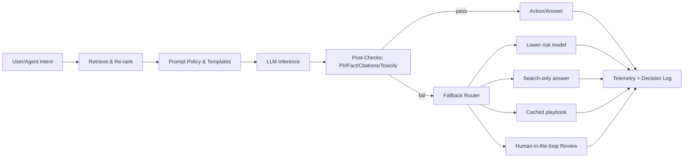

# Week07 — Day03: Model Risk Management & Guardrails (Policy → Pipeline)

*Save as:* `wk07/day03_model_risk_management_guardrails.md`

> **CXO Lens (Deloitte-grade):** “Safe” is measurable. We turn policy into **gates, evals, and kill-switches** that ship with every model, prompt, and agent. If we can’t test it, we can’t trust it—and we don’t deploy it.

---

## Why this matters (board rationale)

* **Fiduciary duty:** Unchecked models create financial, legal, and brand risk. MRM reduces loss severity and speeds regulated approvals.
* **Velocity with safety:** Releasing behind gates lets teams ship faster **and** sleep at night.
* **Auditability:** Executives need **evidence on demand**: what ran, on which data, with which guardrails, and who approved it.

---

## Target outcomes (this week)

* **Tiered MRM framework** in place (use-case → Tier → required tests → approval gate).
* **Evaluation harness live** with golden sets & red-team probes; pass/fail thresholds codified.
* **Guardrail runbooks** for fallback, circuit breaking, and incident handling; **rollback proof** artifact produced.

---

## Core definitions

* **MRM Tier:** Risk level from *Low* (read-only assist) to *Critical* (autonomous actions, PII).
* **Approval Gate (Gx):** Formal checkpoint (G1 Design → G2 Pre-prod → G3 Production) with **objective criteria**.
* **Guardrail:** Automated control pre/in/post-inference (policy, filters, validators, human review).
* **Rollback Proof:** Evidence that traffic was reverted and the prior safe state restored (with timestamps & SHAs).

---

## Activities (⏱ 75–90 minutes)

### 1) Risk Tiering (20m)

Score top 5 models/agents on **Impact × PII/Regulatory × Autonomy**.

| Tier              | Examples                                               | Required Approvals    | Observability                 |
| ----------------- | ------------------------------------------------------ | --------------------- | ----------------------------- |
| **T1 – Low**      | Internal Q\&A, read-only summarizers                   | Product Owner         | Basic logs, usage metrics     |
| **T2 – Moderate** | Customer-facing answers with citations; form auto-fill | PO + Platform + Legal | Full tracing, evals nightly   |
| **T3 – High**     | Workflow execution, ticket updates, outbound emails    | Add CISO + Risk       | Real-time guardrails + HITL   |
| **T4 – Critical** | Financial ops, PII processing, irreversible actions    | ELT/GRC Gate          | Canary + 4-eyes + kill-switch |

> **Rule of thumb:** Any agent with **write** permissions or **PII** processing is **T3+**.

---

### 2) Eval Matrix (25m)

Define metrics, datasets, and thresholds. Store in `wk07/mrm/evals_catalog.md`.

| Dimension         | Metric                 | Threshold (T2/T3/T4)       | Dataset/Evidence              |
| ----------------- | ---------------------- | -------------------------- | ----------------------------- |
| **Groundedness**  | Citation coverage      | ≥95% / ≥97% / ≥99%         | Golden Q\&A set w/ sources    |
| **Factuality**    | Unsupported claim rate | ≤2% / ≤1% / ≤0.5%          | Fact-check harness            |
| **Privacy**       | PII leak probe         | 0 leaks                    | PII canary set (emails, SSNs) |
| **Safety**        | Toxicity score         | ≤0.03 / ≤0.02 / ≤0.01      | Safety suite v4               |
| **Bias/Fairness** | Group parity Δ         | ≤7% / ≤5% / ≤3%            | Fairness set v2               |
| **Reliability**   | p95 latency            | ≤1500ms / ≤1200ms / ≤900ms | Load tests                    |
| **Cost**          | Unit cost              | budget-1σ                  | FinOps meter                  |
| **Drift**         | PSI vs. baseline       | ≤0.25 / ≤0.2 / ≤0.15       | Weekly                        |

> **Datasets you’ll need:**
> *Golden sets* (truth with citations), *toxic prompts*, *jailbreak probes*, *privacy canaries*, *bias panels*, and *live shadow-traffic captures*.

---

### 3) Guardrails & Fallbacks (20m)

Map policy to pipeline controls. Save in `wk07/mrm/guardrails.md`.

#### Guardrail architecture



#### Examples of controls

* **Pre-inference:** prompt linting, tool whitelist, max tokens, rate limiting, **policy tags** (region, PII).
* **In-inference:** function budget (max tool calls), tool arg schemas, sensitive-topic blocking.
* **Post-inference:** PII scrubber, citation validator, toxicity filter, regex/semantic compliance checks.
* **Runtime:** **Circuit breakers** (latency/cost/deflect rate), canary % traffic with auto-revert.

#### Fallback routing matrix

| Failure           | Fallback A          | Fallback B              | Escalation     |
| ----------------- | ------------------- | ----------------------- | -------------- |
| Missing citations | Search-only + links | Lower-temp retry        | HITL queue     |
| PII detected      | Redact → re-ask     | Decline with policy msg | Privacy review |
| Toxic content     | Safe completion     | Block with UX guidance  | Safety review  |
| Cost spike        | Smaller model       | Cache known answer      | FinOps alert   |
| Latency breach    | Time-box + partial  | Async notify            | SRE on-call    |

---

### 4) Incident Playbook (10–25m)

Create `wk07/mrm/incident_playbook.md`.

**Severity ladder**

* **Sev-1:** Customer harm, legal exposure, data leak → **all hands**, 30-min updates.
* **Sev-2:** Wrong actions reversed, no external harm → 60-min updates, 24h fix.
* **Sev-3:** Contained issue, degraded quality → next business day.

**Roles:** Incident Commander (IC), Communications, Tech Lead, Safety/Risk, Scribe.
**First hour checklist:** Identify, contain (kill-switch/circuit break), communicate, collect artifacts, assign RCA.
**Postmortem (≤7 days):** blameless doc, contributing factors, controls added, owner & due date.

---

## Deliverables

* `wk07/mrm/tiering.md` — tiers, scoring rubric, and examples.
* `wk07/mrm/evals_catalog.md` — metrics, datasets, thresholds, and ownership.
* `wk07/mrm/guardrails.md` — architecture, controls, fallback matrix, circuit breakers.
* `wk07/mrm/incident_playbook.md` — Sev ladder, roles, comms, and RCA template.
* `wk07/mrm/release_checklist.md` — go/no-go gate with evidence links.

---

## Acceptance & QA

* **T3+** use-cases show **pre-prod eval runs** meeting thresholds and stored in artifact repo.
* **Release checklist** includes owner, version/SHAs, kill-switch location, and rollback steps.
* **Sev-2+** incidents reach postmortem with corrective actions committed in **≤7 days**.

---

## Release Gate (G2 → G3) — Go/No-Go Checklist

* [ ] Tier assigned, owners named (Product, Platform, Risk).
* [ ] All required evals passed; links to artifact runs.
* [ ] Guardrails configured (policy file) and tested.
* [ ] Canary plan + circuit breakers defined (latency, cost, deflect).
* [ ] Rollback plan proven in staging; **rollback proof** template ready.
* [ ] Monitoring dashboards & alerts wired; runbook validated.

---

## Policy-as-code (example)

Save to `policies/guardrails.demo.yaml`.

```yaml
service: "customer_copilot_v1"
tier: T3
regions: ["US","EU"]
controls:
  pre:
    - prompt_template: "v2://customer_citation.mustache"
    - tools_whitelist: ["search","kb_lookup","ticket_update"]
    - max_tokens: 800
  in:
    - max_function_calls: 3
    - sensitive_topic_block: ["health","ssn","payment"]
  post:
    - require_citations: true
    - citation_min_coverage: 0.97
    - pii_scrub: {enabled: true, action: "redact"}
    - toxicity_threshold: 0.02
runtime:
  circuit_breakers:
    - metric: p95_latency_ms
      threshold: 1200
      action: "degrade_to_search"
    - metric: unit_cost_usd
      threshold: 0.012
      action: "switch_model:small"
fallbacks:
  on_missing_citations: ["search_only","human_review"]
  on_pii_detected: ["redact_retry","human_review"]
approvals:
  required: ["PO","Platform","CISO"]
```

---

## Rollback Proof (artifact)

Store artifacts in `artifacts/rollback/`. Example JSON:

```json
{
  "service": "customer_copilot_v1",
  "rollback_id": "RB-2025-09-07-001",
  "trigger": "Toxicity > threshold on canary",
  "from_version": {"model": "m-2025.09.05", "prompt": "p-2.1.3", "git": "b1a2c3"},
  "to_version": {"model": "m-2025.08.22", "prompt": "p-2.0.9", "git": "a9f8e7"},
  "traffic_shift": {"start": "2025-09-07T14:01Z", "100pct_at": "2025-09-07T14:06Z"},
  "validation": {"errors_resolved": true, "metrics_window_min": 30},
  "approved_by": ["IC", "Platform Owner"],
  "notes": "Auto-revert via circuit breaker; postmortem scheduled."
}
```

---

## RACI (snapshot)

| Workstream        | R (Doer)           | A (Accountable)     | C (Consulted)  | I (Informed) |
| ----------------- | ------------------ | ------------------- | -------------- | ------------ |
| Tiering & gates   | Product + Platform | CTO                 | Risk, Legal    | ELT          |
| Eval harness      | MLOps              | Head of ML Platform | Data, QA       | Org          |
| Guardrails config | Platform           | CISO                | Product, Legal | Org          |
| Incidents & RCA   | IC + SRE           | COO                 | Comms, Safety  | Org          |

---

## Day-end checklist

* [ ] Tiers assigned for top 5 use-cases; rubric saved.
* [ ] Eval matrix & datasets catalog committed; first runs executed.
* [ ] Guardrail policy file applied in staging; fallbacks tested.
* [ ] Incident playbook circulated; on-call aware; rollback drill completed.

---

## What “great” looks like

* **Predictable:** Canary, circuit breakers, and HITL keep incidents small and short.
* **Provable:** One click from dashboard to artifacts: eval runs, policy files, versions, and approvals.
* **Repeatable:** Every new model/prompt/agent passes the **same** gates—no bespoke heroics.

---

> **Next up (Day04):** **Cost & FinOps for AI** — budget envelopes, unit-economics SLOs, and real-time spend guards so innovation doesn’t outpace CFO tolerance.

