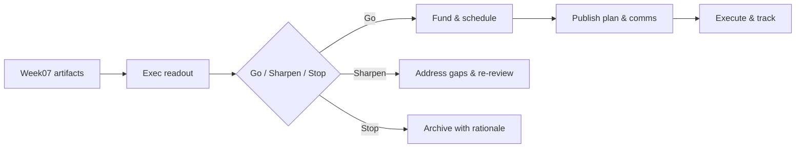

# Week07 — Day07: Executive Readout — Pilot‑to‑Platform Go/No‑Go

> **CXO Lens:** We turn Week07 artifacts into a **decision**: scale, sharpen, or stop. Decisions are logged with owners, budgets, and dates.

---

## Objectives
- Present value scores, SLO readiness, MRM results, and unit economics.
- Decide **Go/No‑Go** for top 3 use cases and allocate capital accordingly.
- Approve **enablement plan** and Champions kickoff.

---

## Lesson Summary
Strategy is choosing what **not** to do. We ratify investments, codify guardrails, and publish the next 90‑day plan.

---

## Activities (⏱ 75–90 minutes)
1) **Readout (20m)** — value math, risk posture, SLOs, cost curves.
2) **Decisions (25m)** — Go/No‑Go, budget shifts, hiring approvals.
3) **Plan (20m)** — 90‑day deliverables, metrics, review cadence.
4) **Communicate (10–25m)** — CEO note, ELT brief, Champions announcement.

---

## Deliverables
- `wk07/exec_readout.md` — slides/notes with links to evidence.
- `wk07/decision_log.md` — decisions, owners, dates, proof.
- `wk07/90day_plan.md` — goals, milestones, dashboards.

---

## Acceptance & QA
- Decisions logged within **24h** with evidence links.
- Budgets and headcount updated in **source of truth**.
- CEO/ELT comms reviewed and scheduled.

---

## Mermaid — Decision Flow

