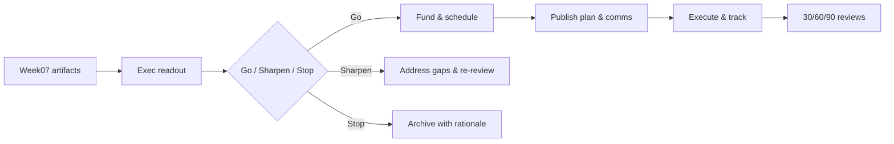

# Week07 — Day07: Executive Readout — Pilot-to-Platform Go/No-Go

*Save as:* `wk07/day07_executive_readout_go_no_go.md`

> **CXO Lens (Deloitte-grade):** We turn Week07 artifacts into a **decision**: scale, sharpen, or stop. Every decision is time-boxed, owner-assigned, budgeted, and evidenced. No “we’ll revisit later.”

---

## Why this matters (board rationale)

* **Focus:** Capital flows to **few, provable winners**; everything else exits gracefully.
* **Accountability:** Decisions and dollars tie to **SLOs, guardrails, and unit economics**—not vibes.
* **Repeatability:** A standard Go/No-Go ritual becomes the **operating rhythm** for AI investments.

---

## Objectives (today)

* Present **value scores**, **SLO readiness**, **MRM results**, and **unit economics** for top use cases.
* Decide **Go / Sharpen / Stop** for the top 3, with **budget shifts and owners**.
* Approve **Enablement & Champions** kickoff aligned to scaled use cases.

---

## Inputs (artifact pack)

| Stream                 | Artifact                                                  | Where                                                    |
| ---------------------- | --------------------------------------------------------- | -------------------------------------------------------- |
| Value & Prioritization | Use-case scores (V×F×R), Investment Briefs                | `wk07/usecase_scores.csv`, `wk07/investment_briefs/`     |
| Data Trust             | Data contracts, Lineage map, Deletion proof SOP           | `wk07/data_contracts/`, `wk07/lineage/`, `wk07/privacy/` |
| Reliability            | SLO catalog & dashboards                                  | `wk07/observability/slo_catalog.md`                      |
| Safety                 | MRM tiering, Eval catalog, Guardrails & incident playbook | `wk07/mrm/*`                                             |
| Economics              | Cost model, Scenarios, Optimization backlog               | `wk07/finops/*`                                          |
| Adoption               | Trust UX patterns, Error playbook, Feedback wiring        | `wk07/ux/*`                                              |
| Change                 | Enablement plan, Champions charter, comms pack            | `wk07/enablement/*`, `wk07/champions/*`, `wk07/comms/*`  |

---

## Agenda (⏱ 75–90 minutes)

1. **Readout (20m)** — value math, SLO posture, MRM status, cost curves, adoption readiness.
2. **Decisions (25m)** — Go/Sharpen/Stop; budget shifts; hiring/partner approvals.
3. **Plan (20m)** — 90-day outcomes, milestones, dashboards, review cadence.
4. **Communicate (10–25m)** — CEO note, ELT brief, Champions announcement.

---

## Decision criteria (traffic-light)

| Dimension            | Green (Go)                                | Yellow (Sharpen)                    | Red (Stop)                      |
| -------------------- | ----------------------------------------- | ----------------------------------- | ------------------------------- |
| **Value**            | Quantified ROI ≥ hurdle; sponsor signed   | ROI plausible but baseline weak     | No clear value metric/sponsor   |
| **SLOs**             | Meets latency/reliability; on-call ready  | Minor gaps with ETA ≤ 30 days       | Gaps unknown or > 30 days       |
| **Safety (MRM)**     | Required evals pass; rollback tested      | 1–2 thresholds close; fixes planned | Material safety/privacy risks   |
| **Economics**        | Unit cost ≤ target; forecast within ±5%   | Within ±15% with clear levers       | Uncapped or non-traceable spend |
| **Data Trust**       | Contracts + lineage + deletion proofs     | 1–2 contracts pending (<30 days)    | No contracts/ownership gaps     |
| **Adoption/UX**      | Trust UX live; feedback loop wired        | Patterns drafted; copy pending      | No trust affordances            |
| **Change Readiness** | Champions named; enablement calendar live | Partial coverage; dates set         | No capacity to support scale    |

> **Rule:** Any **Red** → Stop (or Sharpen to green within 30 days). Majority **Green** with no Red → Go.

---

## Executive Readout framing (slide outline)

1. **Why now / win recap** (1 slide)
2. **Use-case scorecard** — Value, SLO, MRM, UCR, Readiness (1 slide per use case)
3. **Risks & mitigations** — top 3 with owners/dates (1 slide)
4. **Economics** — unit cost trend, forecast, optimization levers (1 slide)
5. **Scale plan** — environments, rollout waves, kill criteria (1 slide)
6. **Enablement** — Champions map, office hours, comms (1 slide)
7. **Decision request** — Go/Sharpen/Stop + budget/headcount (final slide)

---

## Go/Sharpen/Stop templates

### Go (scale with guardrails)

```
Decision: GO — <Use Case>
Owner: <VP/Product Owner>
Budget: $<amount> through <quarter>
Milestones: G2 -> First scale release <date>; Wave 2 <date>
Guardrails: p95 ≤ 1200 ms; grounded rate ≥ 4.2/5; UCR ≤ $0.010
Proof links: <dashboards, eval runs, contracts>
Comms: CEO note + #champions rollout by <date>
```

### Sharpen (address gaps, time-boxed)

```
Decision: SHARPEN — <Use Case>
Owner: <Head of Platform/Product>
Gaps: SLO drift; eval threshold margin; data contract missing for <table>
Plan: Fix list with ETAs (≤ 30 days); re-review on <date>
Budget: Bridge funding $<amount>
Exit: If gaps persist, auto-Stop; archive brief with rationale
```

### Stop (graceful exit)

```
Decision: STOP — <Use Case>
Owner: <PM>
Rationale: <value shortfall / risk / cost>
Actions: Decommission plan; learnings write-up; notify stakeholders
Capital: Reallocated to <use case(s)>
```

---

## Deliverables (today)

* `wk07/exec_readout.md` — narrative + slide links + evidence.
* `wk07/decision_log.md` — each decision (ID, owner, budget, due, proof).
* `wk07/90day_plan.md` — outcomes, milestones, dashboards, review cadence.

**Decision log entry (example)**

```yaml
id: DEC-2025-09-07-02
title: GO — Ops Copilot scale to Wave 2
owner: VP Operations
budget_usd: 250000
evidence:
  - wk07/usecase_scores.csv#ops_copilot
  - wk07/observability/slo_dashboard.png
  - wk07/mrm/evals_catalog.md
  - wk07/finops/cost_model.xlsx
guardrails:
  - p95_latency_ms <= 1200
  - grounded_score >= 4.2/5
  - unit_cost_usd <= 0.010
milestones:
  - wave2_launch: 2025-10-15
  - enablement_boost: 2025-09-25
status: Approved
```

---

## 90-day plan (structure)

| Outcome      | Metric & Target                | Owner  | When    | Dependencies    | Risks & Mitigation        |
| ------------ | ------------------------------ | ------ | ------- | --------------- | ------------------------- |
| Wave-2 scale | DAU +40%, incident rate ≤ 0.3% | Ops    | Oct–Nov | SRE, Enablement | Traffic spike → autoscale |
| Trust lift   | Citation CTR +20%              | PMM    | Oct     | UX              | Low CTR → copy test A/B   |
| Cost control | UCR −15% via cache + routing   | FinOps | Nov     | Platform        | Drift → weekly review     |
| Safety       | Quarterly red-team complete    | CISO   | Dec     | Product         | Findings → patch sprint   |

---

## Communications (ready-to-send)

**CEO note (internal):**

> Team — we’re green-lighting **Ops Copilot** to Wave 2. Why: clear ROI, steady SLOs, proven safety, and predictable unit economics. Guardrails are unchanged; success looks like faster tasks with citations and stable costs. Champions will host office hours next week. Thank you to everyone who shipped the foundations.

**ELT brief (bullets):**

* Go: Ops Copilot; Sharpen: Customer Copilot (SLO gap); Stop: Legacy summarizer
* Budget shifts: +\$250k to Ops; −\$150k from Legacy; headcount +1 SRE (Q+1)
* Risks: EU privacy nuance → contract update in progress (Legal/Sec)

**Champions announcement (Slack/Teams):**

> 🚀 Scaling Ops Copilot: Wave 2 starts <date>. Demo + Q\&A in #demo-day, office hours Wed 11:00. Post wins in #wins. Tag @Champions-Ops for fast help.

---

## Acceptance & QA

* All decisions **logged within 24h** with links to evidence and owners.
* Budgets/headcount updated in the **source of truth** (FP\&A + HR systems).
* CEO/ELT communications **reviewed and scheduled**; Champions calendar posted.

---

## Dashboards to monitor (post-decision)

* **Exec:** ROI vs plan; UCR trend; incidents; adoption curve.
* **Ops:** p95 latency/error rate; cache hit; depth-k distribution.
* **Safety:** eval pass rate; incident MTTR; red-team findings to closure.
* **Change:** lab completions; office-hour attendance; ticket deflection by Champions.

---

## Mermaid — Decision Flow



---

## Day-end checklist

* [ ] `exec_readout.md` published with slide links
* [ ] `decision_log.md` updated for each use case
* [ ] `90day_plan.md` approved with dashboards and cadence
* [ ] Comms queued (CEO, ELT, Champions); calendars updated

---

## What “great” looks like

* **Clarity:** One page tells you *what we’re doing, why, who, and by when*.
* **Discipline:** Funding follows evidence; reds stop; yellows sharpen; greens scale.
* **Momentum:** Within one week, enablement is live, metrics move, and stories travel.

