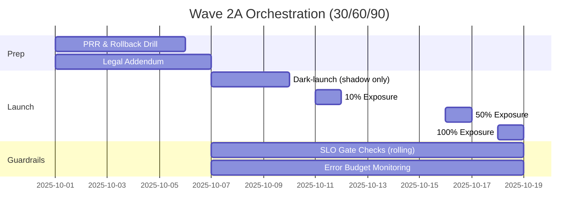

# Week08 — Day01: Scale Plan & Wave Orchestration (30/60/90)

*Save as: `wk08/day01_scale_plan_wave_orchestration.md`*

> **CXO Lens (Deloitte-grade):** We translate Go decisions into a **sequenced wave plan** with dependencies, freeze windows, and measurable business outcomes. No mystery work—only funded, scheduled outcomes with rollback proof.

---

## Why this matters (board rationale)

* **Capital focus:** Scaling concentrates spend on **few, provable winners** tied to KPI deltas.
* **Risk containment:** Feature flags + freeze windows + rollback drills reduce execution risk.
* **Operator trust:** One page tells leaders **who/what/when**, SLO gates, and “stop/roll back” criteria.

---

## Objectives (today)

* Lock **Wave plan** (environments, cohorts, dates) and **freeze windows**.
* Map **dependencies & risks**; publish **critical path** and **burndown**.
* Tie rollout to **business KPIs** and **SLO guardrails** (with data owners and dashboards).

---

## Lesson summary

Scaling fails where sequencing fails. We publish a **single source of truth** for who/what/when, with a **cutover plan** that keeps **value** and **safety** front and center.

---

## Pre-requisites (must be true before you plan)

* Week07 **Go/Sharpen/Stop** decisions logged with owners, budgets, guardrails.
* **PRR** checklist ≥ 90% green (remaining items time-boxed ≤ 14 days).
* **Data contracts & lineage** updated for all paths touched by the wave.
* **SLO dashboards** live for latency, errors, cache hit, depth-k, **unit cost**.

---

## Activities (⏱ 75–90 minutes)

1. **Wave Design (25m)** – Define cohorts (geo, BU, role), environments (staging → prod), **feature flags**, dark-launch scope.
2. **Critical Path (20m)** – Identify dependencies, freeze windows, **rollback triggers**, and owners.
3. **Outcome Tie-in (20m)** – Set KPI deltas per wave; define **SLO gates** per stage (promote only on green).
4. **Burndown Setup (10–25m)** – Stand-up cadence, blocker escalation, **RAID** log (Risks, Assumptions, Issues, Dependencies).

---

## Deliverables

* `wk08/scale/wave_plan.md` — waves, cohorts, flags, dates, freeze windows.
* `wk08/scale/critical_path.md` — dependencies, owners, risk register.
* `wk08/scale/burndown_board.csv` — tasks, ETA, blocker status (daily).

---

## Acceptance & QA

* Each wave has **KPI targets**, **SLO gates**, and **rollback criteria**.
* **RAID log** active; daily burndown cadence established and staffed.
* Freeze windows communicated to **Ops/SRE/Sec/Legal** with on-call coverage.

---

## Wave plan (outline & example)

```md
Wave: 2A (Ops – North America)
Dates: 10/07–10/18
Cohort: Tier-1 operations teams (NA, 300 users)
Flags: retrieval_v2=true, large_model=false, safe_completion=high
Dark-launch: 10/07–10/10 (shadow only; no user action)
Cutover: 10/11 (10% exposure) → 10/16 (50%) → 10/18 (100%)
KPIs: AHT −15%, Task success ≥ 70%, Grounded score ≥ 4.2/5
SLO gates (promote only if green): p95 ≤ 1200 ms; error ≤ 1.0%; cache hit ≥ 55%
Rollback: version 1.3.5 — tested; target TTR ≤ 30 minutes
Owner: VP Ops • IC (incident commander): SRE On-Call
```

---

## Feature flag strategy (matrix)

| Flag                      | Default | Wave 2A | Wave 2B | Notes                              |
| ------------------------- | :-----: | :-----: | :-----: | ---------------------------------- |
| `retrieval_v2`            |   off   |    on   |    on   | Requires new re-rank route         |
| `large_model`             |   off   |   off   |    on   | Enable at 50% only if UCR ≤ target |
| `safe_completion`         |   med   |   high  |   high  | Higher guardrails in early waves   |
| `cite_panel_default_open` |    on   |    on   |    on   | Trust UX requirement               |

> **Rule:** Flags flip **only** when SLO gates are green and KPI deltas are trending to target for ≥48 hours.

---

## Critical path (sample)

```md
1) Data contract v3 signed (customer_events_v1) — Owner: Data Platform — DUE: 10/03
2) SLO dashboards promoted to prod — Owner: SRE — DUE: 10/04
3) Rollback drill (Sev-2 tabletop) — Owner: Platform — DUE: 10/05
4) Privacy review: sub-processor addendum — Owner: Legal — DUE: 10/06
5) Dark-launch enable — Owner: Product — DUE: 10/07
6) 10% exposure + monitor — Owner: MLOps — DUE: 10/11
7) 50% exposure + cache policy raise — Owner: Platform — DUE: 10/16
8) 100% exposure — Owner: BU Lead — DUE: 10/18
```

---

## Freeze windows & change policy

* **Code freeze:** 24h before each exposure step; security hotfixes exempt with IC approval.
* **Data changes:** No schema or contract changes during exposure windows.
* **Vendor changes:** Model/provider switches require **table-top drill** + sign-off from Platform & Sec.

---

## KPI & SLO guardrails (targets)

| Dimension   | Metric                      | Target (gate)             | Evidence               |
| ----------- | --------------------------- | ------------------------- | ---------------------- |
| Value       | Average Handle Time (AHT)   | −15% vs. baseline         | Outcome telemetry      |
| Value       | Task success rate           | ≥ 70%                     | UX analytics           |
| Trust       | Grounded answer rating      | ≥ 4.2 / 5                 | Eval dashboard         |
| Reliability | p95 end-to-end latency      | ≤ 1200 ms                 | SLO dashboard          |
| Reliability | Error rate                  | ≤ 1.0%                    | SLO dashboard          |
| Economics   | Unit cost per request (UCR) | ≤ budgeted run-rate       | FinOps spend SLO       |
| Privacy     | Deletion proof SLA          | ≤ 72 hours (100% on time) | Privacy proof registry |

---

## Rollback runbook (excerpt)

```md
Trigger: Any SLO gate breached for > 30 minutes OR KPI regression ≥ 10% sustained.
Steps:
  1. IC declares Sev-2; freeze further exposure; notify #ai-ops, #exec-status.
  2. Flip flags: retrieval_v2=false (or) route to previous model version 1.3.5.
  3. Drain in-flight requests; validate health checks; run smoke tests.
  4. Post-incident: RCA within 48h; add corrective action to RAID with owner/date.
Target time to restore (TTR): ≤ 30 minutes end-to-end.
```

---

## RAID log (starter)

```md
# wk08/scale/raid_log.md
- RISK: Cache hit below 50% in NA; IMPACT: Latency & cost ↑; OWNER: Platform; MITIGATION: Warm-up job + semantic cache; DUE: 10/09
- ASSUMPTION: Legal addendum approved by 10/06; OWNER: Legal
- ISSUE: Re-rank service CPU throttling in peak; OWNER: SRE; ACTION: Autoscale policy; DUE: 10/08
- DEPENDENCY: Data contract v3 signed; OWNER: Data Platform; DUE: 10/03
```

---

## Burndown board (CSV schema)

```csv
id,task,owner,start_date,due_date,status,blocker,notes
T-001,Promote SLO dashboards,SRE,2025-10-01,2025-10-04,In-Progress,,Grafana prod link
T-002,Rollback drill,Platform,2025-10-02,2025-10-05,Planned,,Sev-2 tabletop
T-003,Legal addendum,Legal,2025-10-01,2025-10-06,Planned,,Sub-processor update
T-004,Dark-launch enable,Product,2025-10-06,2025-10-07,Planned,Legal addendum,
T-005,10% exposure,MLOps,2025-10-10,2025-10-11,Planned,SLO dashboard,
```

---

## Communications pack (ready to send)

**Leader note (email/Slack):**

> Wave 2A begins **10/07** with a dark-launch and staged exposure (10% → 50% → 100% by **10/18**). Success looks like **AHT −15%**, **task success ≥ 70%**, and **p95 ≤ 1200 ms**. We will only progress when SLO gates are green for 48 hours. Rollback is rehearsed (TTR ≤ 30m). Please review freeze windows and on-call coverage.

**Change log (internal):**

```md
2025-10-07: Dark-launch enabled; no user-visible changes.
2025-10-11: 10% exposure; trust panel default open; monitoring tight.
2025-10-16: 50% exposure; cache policy raised after SLO verification.
2025-10-18: 100% exposure contingent on KPI/SLO gates.
```

---

## RACI (snapshot)

| Workstream         | R (Doer)    | A (Accountable)  | C (Consulted)        | I (Informed) |
| ------------------ | ----------- | ---------------- | -------------------- | ------------ |
| Wave orchestration | Product Ops | Head of Product  | SRE, Platform, Legal | ELT          |
| SLO monitoring     | SRE         | CTO              | Product, Platform    | Org          |
| Rollback readiness | Platform    | Head of Platform | SRE, Security        | Org          |
| Communications     | PMM         | COO              | HR, Legal            | Org          |

---

## Mermaid — 30/60/90 Wave timeline



---

## Day-end checklist

* [ ] `wave_plan.md` published with cohorts, flags, dates, freeze windows.
* [ ] `critical_path.md` complete; RAID log opened and staffed.
* [ ] Burndown board live; daily stand-up & escalation in calendar.
* [ ] KPI deltas & SLO gates configured in dashboards; owners acknowledged.

---

## What “great” looks like

* **Predictable cadence:** Promotions happen on schedule because gates are objective and visible.
* **Operational calm:** Incidents are rare, small, and reversible within **≤ 30 minutes**.
* **Value proof:** Within 2 weeks, KPIs show movement and stories are ready for the CEO deck.
