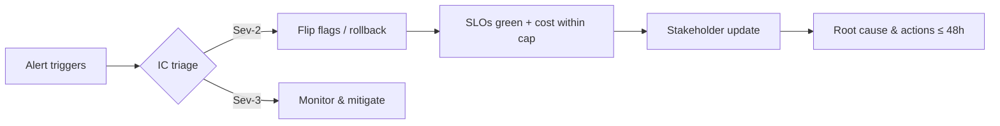

# Week08 — Day02: Production Readiness & Gameday (Resilience First)

*Save as: `wk08/day02_prod_readiness_gameday.md`*

> **CXO Lens (Deloitte-grade):** Reliability is **earned**, not assumed. Today we formalize **Production Readiness Review (PRR)**, run **chaos/gameday** to prove controlled failure, and validate **rollback** + **incident command** so we can scale with confidence.

---

## Why this matters (board rationale)

* **Trust at scale:** One bad outage can erase months of adoption; resilience protects KPI momentum.
* **Cost control:** Fail-safes (circuit breakers, caching, provider failover) cap blast radius and spend.
* **Auditability:** A signed PRR + gameday evidence is what regulators and customers expect.

---

## Objectives (today)

* Complete **PRR** with sign-offs from **SRE, Security, Product, Platform**.
* Execute **load & chaos** tests (timeouts, provider failover, cache cold-start, rate limiting).
* Validate **rollback drills** (TTR ≤ 30 min) and **Incident Commander (IC)** flow (MTTA ≤ 5 min).

---

## Lesson summary

We move from “it should work” to **“we proved it works when things break.”** Readiness lives in **runbooks, dashboards, drills, and decision logs**—not slides.

---

## Pre-requisites

* Week07 Go decisions + guardrails in source of truth.
* SLO dashboards live (latency, error rate, cache hit, unit cost).
* On-call rotations published; pager integrated with runbooks.

---

## Activities (⏱ 75–90 minutes)

1. **PRR Checklist (25m)** — Runbooks, on-call, dashboards, secrets, quotas, vuln scan, data contracts.
2. **Load/Chaos (25m)** — Spike to 2× forecast; fail primary LLM/provider; throttle embeddings; cache cold-start; simulate vector store latency; enforce rate limits.
3. **Rollback Drill (15m)** — Simulated Sev-2; flip flags; cut to previous model/retrieval; smoke tests; cost/latency checks.
4. **IC Tabletop (10–25m)** — Roles, comms templates; MTTA/MTTR rehearsal; stakeholder updates.

---

## Deliverables

* `wk08/readiness/prr_checklist.md` — signed by **SRE, Sec, Product, Platform**.
* `wk08/readiness/gameday_report.md` — scenarios, results, defects, owners, ETAs, evidence links.
* `wk08/runbooks/rollback.md` — step-by-step with screenshots/logs; **TTR proof**.

---

## Acceptance & QA

* **All PRR checks green**; exceptions time-boxed **≤ 14 days** with owners/dates.
* Gameday produced **action items** with owners/ETAs and dashboard links.
* **Rollback verified end-to-end in ≤ 30 minutes** (decision → healthy state).

---

## PRR Checklist (sign-off excerpt)

```md
Service: Ops Copilot API (v2)
Owners: Product (PM), Platform (EM), SRE (IC), Security (AppSec)

[ ] Runbooks: on-call, rollback, rate-limit, cost-spike, data incident
[ ] SLOs: p95 latency, error rate, unit cost, cache hit, depth-k, provider mix
[ ] Dashboards: Grafana links; alert thresholds + routes verified
[ ] Secrets: rotated & scoped (no wildcard perms); vault policies audited
[ ] Quotas & Limits: LLM/provider quotas set; back-pressure tested
[ ] Security: vuln scan clean; SBOM stored; dependency pins; egress rules
[ ] Data Trust: contracts current; lineage up to date; deletion proof path tested
[ ] Compliance: PII classification; red-team findings closed or time-boxed
Sign-off: SRE ☐  Security ☐  Product ☐  Platform ☐   Date: YYYY-MM-DD
```

---

## Gameday scenarios (matrix)

| Scenario                       | Injection Method                      | Expected Behavior                                  | Evidence         |
| ------------------------------ | ------------------------------------- | -------------------------------------------------- | ---------------- |
| **LLM provider outage**        | 502/timeout on primary for 10 min     | Auto-failover to secondary; cost within cap; alert | Logs + dashboard |
| **Cache cold-start**           | Purge semantic/exact caches           | p95 ↑ temporarily; stabilizes ≤ 15 min; alert      | Latency graph    |
| **Vector store latency spike** | Add 300ms to query path               | Depth-k reduces; hit rate ↑; quality stays ≥ gate  | SLO/hit graphs   |
| **Embedding throttle**         | 429 responses for 5 min               | Queue/backoff; drop to fallback model; alert       | Queue depth      |
| **Token cost surge**           | Raise \$/1K tokens in sandbox pricing | Routing shifts small→medium; unit cost stays ≤ cap | FinOps panel     |
| **PII leakage probe**          | Inject privacy test set               | Block by guardrail; log event; notify Security     | Audit log        |

> Record: **start time, detection, decision, action, recovery time, residual risk, owner**.

---

## Rollback runbook (step-by-step)

```md
Trigger: Any SLO red > 30 min OR critical defect OR cost cap breach

1. IC declares Sev-2 (status channel + paging). Freeze exposure.
2. Feature flags: set large_model=false; retrieval_v2=false; route to model v1.3.5.
3. Drain + validate health checks (200s, p95, error rate); run smoke tests (top 5 flows).
4. Verify unit cost back within cap; confirm alerts cleared.
5. IC posts incident update (template below). Open RCA doc; assign owners/ETAs.
Target TTR: ≤ 30 minutes.
```

**IC comms template**

```md
[Sev-2] Ops Copilot degradation @ 10:42
Impact: p95 latency +60%, error 2.3% in NA
Action: Rolled back to v1.3.5 @ 10:55; SLOs green @ 11:08
Next: Root cause (re-rank CPU throttle); fix ETA EOD; follow-up 16:00
Owner: IC-SRE @handle | Status page updated
```

---

## Metrics to track (and targets)

* **MTTA** ≤ 5 min • **MTTR/TTR** ≤ 30 min • **Change fail rate** ≤ 15%
* **Error budget** consumption ≤ 25%/month • **Failover success rate** 100% in drills
* **Cost containment:** unit cost back within cap ≤ 15 min after event

---

## Dashboards

* **SRE:** latency p50/p95, error rate, saturation, cache hit, depth-k, provider mix
* **FinOps:** unit cost/request trend, spend vs cap, anomaly alerts
* **Safety:** guardrail hits, red-team triggers, privacy blocks
* **Product:** task success, grounded score, user impact during events

---

## RACI (readiness & gameday)

| Workstream     | R (Doer) | A (Accountable)  | C (Consulted)     | I (Informed) |
| -------------- | -------- | ---------------- | ----------------- | ------------ |
| PRR completion | SRE      | Head of Platform | Security, Product | ELT          |
| Chaos/gameday  | SRE      | CTO              | Platform, Product | Org          |
| Rollback drill | Platform | Head of Platform | SRE, Security     | Org          |
| IC/Comms       | SRE      | COO              | Legal, PMM        | Org          |

---

## Mermaid — incident flow



---

## Day-end checklist

* [ ] `prr_checklist.md` signed by all functions; exceptions time-boxed ≤ 14 days
* [ ] `gameday_report.md` published with evidence + owner/ETA per defect
* [ ] `rollback.md` validated; **TTR ≤ 30 min** captured with timestamps
* [ ] MTTA/MTTR and failover success recorded on dashboards

---

## What “great” looks like

* **Predictable recovery:** Alarms route to the right humans; decisions happen fast.
* **Controlled blast radius:** Failover, flags, and budgets keep incidents small and cheap.
* **Evidence trail:** Auditors, customers, and the board can see **proof** we’re production-ready.

