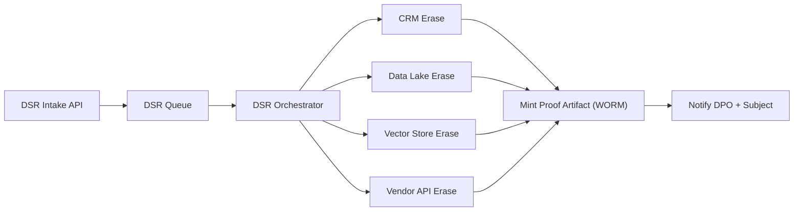

# Week08 — Day03: Privacy Attestations & Audit Pack (DPIA → Proof)

*Save as: `wk08/day03_privacy_attestations_audit_pack.md`*

> **CXO Lens (Deloitte-grade):** Private AI earns trust through **evidence, not promises**. Today we ship a board- and regulator-ready **privacy pack**: DPIA/SRA, RoPA, data-flow & residency maps, and automated DSR proofs with immutable artifact IDs.

---

## Why this matters (board rationale)

* **Regulatory resilience:** Demonstrable controls reduce fines, sales friction, and deal risk.
* **Customer trust:** Proofs (not slideware) enable enterprise procurement and security sign-off.
* **Operational clarity:** Contracts + lineage + automation make privacy **repeatable** at scale.

---

## Objectives (today)

* Complete **DPIA/SRA** and update **RoPA** (Records of Processing Activities).
* Finalize **data-flow & residency diagrams**; review **vendor/sub-processors**.
* Automate **DSR** (access/delete) proofs that mint **artifact IDs** within SLA.

---

## Lesson summary

We convert privacy from a policy set to a **living system**: documented purposes, mapped flows, automated deletion/access proofs, and a versioned audit trail.

---

## Activities (⏱ 75–90 minutes)

1. **DPIA/SRA (30m)** — Purpose, lawful basis, data categories, risks, mitigations, residual risk, approvals.
2. **Data-Flow (20m)** — Source → Transform → Feature → Model → Product; cross-border paths; residency & retention.
3. **DSR Automation (15m)** — Request intake → propagation → proof artifact → SLA alarms.
4. **Sub-processor Review (10–25m)** — Due diligence, SCCs/DPAs, egress terms, breach comms clauses.

---

## Deliverables

* `wk08/privacy/dpia.md` • `wk08/privacy/sra.md` • `wk08/privacy/ropa.md`
* `wk08/privacy/data_flow.png` • `wk08/privacy/residency_matrix.md`
* `wk08/privacy/dsr_automation.md` — API spec, queue/design, proof samples
* `wk08/privacy/subprocessors/register.md` — inventory + contract links
* `wk08/privacy/attestation_pack/README.md` — how to hand to auditors/customers

---

## Acceptance & QA

* **DPIA/SRA** signed by **Legal, CISO, DPO**; residual risks + mitigations documented.
* **Deletion/access proof** produced **≤ 72h** with immutable artifact ID + lineage evidence.
* **Sub-processor register** current; contracts include **data ownership, egress rights, breach SLAs**.
* **Residency matrix** enforced via policy + tests (no cross-region drift).

---

## DPIA (outline template)

```md
# DPIA — <System / Use Case>
Purpose & Lawful Basis: <purpose, contract/consent/legitimate interest>
Data Subjects & Categories: <employees, customers, PII types>
Processing Activities: <ingest, featureization, inference, logging>
Risks (Inherent): <reidentification, leakage, bias, misuse>
Controls (Preventive/Detective/Corrective): <pseudonymization, RBAC, DLP, evals>
Residual Risk: <Low/Med/High>  | Risk Owner: <name>
Third Countries & Safeguards: <SCCs, adequacy, local hosting>
Retention & Deletion: <policy, TTL, DSR mechanics>
Approvals: Legal ☐  CISO ☐  DPO ☐  Product ☐  Date: YYYY-MM-DD
```

---

## Security Risk Assessment (SRA) — key checks

* **Access:** RBAC/ABAC, least privilege, just-in-time secrets, break-glass logging.
* **Storage:** Encryption at rest, key management, snapshot policies, hot/warm/cold tiers.
* **Transit:** TLS policies, mTLS for internal services, certificate rotation.
* **Inference:** Prompt injection defenses, retrieval allow-lists, output filtering, PII scrubbing.
* **Monitoring:** DLP signatures, egress alerts, anomaly detection, audit log immutability.
* **Change:** CAB approvals for model/prompt updates; rollback artifacts preserved.

---

## RoPA (Records of Processing Activities) — snippet

```yaml
process: "Ops Copilot Q&A"
controller: "<Company, Inc.>"
processors:
  - name: "<LLM Vendor>" 
    role: "sub-processor"
    dpa: "link"
data_categories: ["contact", "usage", "transactional"]
subjects: ["employees", "customers"]
purposes: ["productivity", "support"]
lawful_basis: ["legitimate_interest"]
retention: "90d logs; 24h transient features; 0d vendor retention"
transfers: { regions: ["US","EU"], safeguards: "SCCs + EU hosting" }
contacts: { dpo: "dpo@company.com", security: "security@company.com" }
```

---

## Data-flow & Residency

**What to show on `data_flow.png`:**

* Sources (CRM, ticketing, knowledge base, call logs)
* ETL/ELT + feature store + vector store + model endpoints
* Orchestration path (retrieve → re-rank → generate) with guardrails
* **Region boundaries** and **no-cross** policies; red egress arrows (blocked)

**Residency Matrix (`residency_matrix.md`)**

| Region | Data at Rest       | Processing Region | Cross-Border Allowed | Safeguard | Owner |
| ------ | ------------------ | ----------------- | -------------------- | --------- | ----- |
| EU     | EU-West (primary)  | EU-West           | No (default)         | SCCs opt  | DPO   |
| US     | US-East (primary)  | US-East           | No (default)         | N/A       | CISO  |
| APAC   | AP-Southeast (opt) | AP-Southeast      | Yes (legal req only) | SCCs      | Legal |

**Controls to implement**

* Region-pinned storage classes and compute pools
* Policy tests: synthetic PII seeded in EU never appears in US logs
* CI check: deployments fail if region mismatch or egress rule missing

---

## DSR Automation (`dsr_automation.md`)

### Architecture

* **Intake API** → **DSR Queue** → **Orchestrator** (sources: OLTP, data lake, vector store, search index, vendor API) → **Proof Minting** (artifact in WORM storage) → **Notifier**.

### API (example)

```http
POST /privacy/dsr
{
  "type": "erasure", 
  "subject_id": "cust_9832",
  "jurisdiction": "GDPR",
  "requested_by": "dpo@company.com",
  "evidence_links": ["ticket://12345"]
}
```

**Response**

```json
{ "request_id": "DSR-2025-0910-001", "sla_deadline": "2025-09-13T12:00:00Z" }
```

### Orchestrator (pseudo-code)

```python
for connector in ["crm","support","events","vector_store","search","vendor_llm"]:
    result = connector.erase(subject_id)
    log.append({"connector": connector, "status": result.status, "ts": now()})

artifact = {
  "request_id": req_id,
  "subject_id": subject_id,
  "completed_at": now(),
  "connectors": log,
  "hash": sha256(log),
}
store_worm("proofs/"+req_id+".json", artifact)
```

### Proof artifact (sample)

```json
{
  "request_id": "DSR-2025-0910-001",
  "connectors": [
    {"name":"vector_store","status":"deleted","ts":"2025-09-10T10:33Z","ids":["vec_8821","vec_8822"]},
    {"name":"search","status":"deleted","ts":"2025-09-10T10:34Z","ids":["doc_7281"]}
  ],
  "auditor_hash":"a9f1...22c",
  "completed_at":"2025-09-10T10:36Z",
  "verifier":"privacy-bot@company.com"
}
```

**SLAs & Alarms**

* **Deletion proof ≤ 72h** (target ≤ 24h) → Pager if at **T-12h** not complete
* Weekly DSR **drill** with synthetic subject IDs; publish pass/fail

---

## Sub-processor due diligence (`subprocessors/register.md`)

* **Inventory:** service, data categories touched, region, role (processor/sub-processor)
* **Assurance:** SOC 2 / ISO 27001, pen test letter, breach history, data retention defaults
* **Contracts:** DPA/SCCs, sub-processor flow-downs, **egress rights**, **30-day parallel run** clause
* **Technical:** regional hosting, tenant isolation, encryption model, deletion APIs
* **Runbook:** breach comms path, 24×7 contacts, RTO/RPO, evidence delivery format

---

## Attestation Pack (`attestation_pack/README.md`)

**For auditors & enterprise security teams:**

* DPIA, SRA, RoPA (signed)
* Data-flow diagram & residency matrix
* DSR automation spec + **sample proof artifact** (masked)
* Sub-processor register + DPAs/SCCs links
* Evidence bundle: lineage screenshots, deletion logs, eval/guardrail results
* Contact sheet: DPO, Security, Product, Incident on-call

---

## Mermaid — DSR flow



---

## RACI

| Workstream        | R (Doer)    | A (Accountable)  | C (Consulted)     | I (Informed) |
| ----------------- | ----------- | ---------------- | ----------------- | ------------ |
| DPIA/SRA          | Legal, Sec  | DPO              | Product, Platform | ELT          |
| RoPA & Data-flows | Data Gov    | CISO             | Legal, Product    | Org          |
| DSR Automation    | Platform    | Head of Platform | Security, Legal   | Support      |
| Sub-processors    | Procurement | COO              | Legal, Security   | ELT          |

---

## Day-end checklist

* [ ] `dpia.md`, `sra.md`, and `ropa.md` finalized and signed
* [ ] `data_flow.png` and `residency_matrix.md` published; tests green
* [ ] `dsr_automation.md` live; **sample proof** generated (synthetic ID)
* [ ] `subprocessors/register.md` updated; contracts verified
* [ ] `attestation_pack/README.md` links assembled for external review

---

## What “great” looks like

* **Answerable in minutes:** “Prove deletion” → link to artifact with hashes & timestamps.
* **No surprises:** Residency enforced by policy + tests; cross-border drift fails CI.
* **Sales-ready:** Security reviews pass on **first cycle** because evidence is organized and current.

