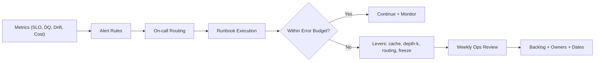

# Week08 — Day04: Observability at Scale (Error Budgets & SLO Enforcement)

*Save as: `wk08/day04_observability_slo_enforcement.md`*

> **CXO Lens (Deloitte-grade):** What we don’t **observe**, we can’t **govern**. Today we make performance, safety, **drift**, and **cost** visible in near-real time, enforce **error budgets**, and institutionalize a weekly **Ops Review** that turns signals into action.

---

## Why this matters (board rationale)

* **Reliability you can spend on:** Stable SLOs unlock rollout velocity and lower incident tax.
* **Financial control:** Cost and latency become managed **dials**, not surprises.
* **Trust by design:** Drift, data quality, and safety regressions page us **before** customers or auditors do.

---

## Objectives (today)

* Promote **SLO dashboards** to prod; publish **error-budget policies** per use case.
* Wire **drift** (data + model) and **data-quality** alerts into on-call rotations with runbooks.
* Stand up a **Weekly Ops Review**: SLO posture, incidents/RCA, improvement plan, owners, dates.

---

## Lesson summary

Observability is not a tool—it’s a **contract**: clear SLOs, transparent error budgets, auditable alerts, and a cadence that converts findings into prioritized work.

---

## Activities (⏱ 75–90 minutes)

1. **Dashboards (25m)** — p95 latency, error rate, cache hit, depth-k, **unit cost/request (UCR)**, groundedness, guardrail hits.
2. **Budgets (20m)** — Define **error budget burn** actions (freeze/levers) per use case.
3. **Drift & DQ (20m)** — PSI/KS tests, null/uniqueness rules, freshness SLOs, paging thresholds.
4. **Weekly Ops Review (10–25m)** — Agenda, invite list, artifacts, backlog tagging.

---

## Deliverables

* `wk08/observability/slo_dashboards.png` — executive + ops views.
* `wk08/observability/error_budget_policy.md` — per-use-case rules of engagement.
* `wk08/observability/drift_checks.md` — tests, thresholds, datasets, owners.
* `wk08/observability/weekly_ops_review.md` — agenda, metrics pack, RACI.

---

## Acceptance & QA

* **Error budgets enforced** with documented freeze rule; policy tested in staging.
* **Drift/DQ alerts** firing to on-call with runbooks and Slack/Teams channel.
* **Weekly Ops Review** calendar published; decision log entries created after each session.

---

## SLO catalog (baseline)

| Dimension      | Metric (p95 unless noted)   | Target / Gate            |
| -------------- | --------------------------- | ------------------------ |
| Latency        | end-to-end ms               | ≤ 1200                   |
| Availability   | % over rolling 30d          | ≥ 99.9%                  |
| Error Rate     | 5xx/4xx retriable %         | ≤ 1.0%                   |
| Trust          | groundedness score (1–5)    | ≥ 4.2/5                  |
| Cost           | unit cost per request (UCR) | ≤ target by use case     |
| Retrieval      | cache hit rate              | ≥ 60%                    |
| Data Freshness | minutes since last ingest   | ≤ 15 min (tier-1 tables) |
| Safety         | guardrail hit rate          | ≤ 0.2%                   |

---

## Error budget policy (example)

*File: `wk08/observability/error_budget_policy.md`*

```yaml
use_case: "ops_copilot"
window: "rolling_30d"
error_budget: 0.1        # 0.1 = 0.1 days of downtime in 30 days (~2.4h)
burn_alerts:
  - at: 50%   # half the budget consumed
    actions: ["notify:#sre", "enable_aggressive_cache", "reduce_depth_k"]
  - at: 75%
    actions: ["freeze_noncritical_releases", "route_to_smaller_model", "raise_exec_flag"]
  - at: 100%
    actions: ["feature_freeze_all", "postmortem_required", "CFO_cost_review"]
freeze_release_exceptions:
  approver: "VP Platform"
  criteria: ["security_fix", "sev-1 remediation"]
reporting:
  channel: "#ops-weekly"
  artifacts: ["slo_dashboards.png", "incident_log.csv"]
```

---

## Drift & data-quality checks

*File: `wk08/observability/drift_checks.md`*

**Data drift (features / embeddings)**

* **PSI (Population Stability Index)** threshold: alert at `PSI ≥ 0.2` (medium), page at `≥ 0.3` (high).
* **KS test** for continuous features: alert at `p < 0.05`.
* **Categorical shift**: top-k distribution delta `≥ 10%` triggers review.

**Model drift / output quality**

* Groundedness rolling mean drops `≥ 0.3` from baseline → page.
* Toxicity/PII detectors > threshold → auto-route to human review.

**Data-quality rules (tier-1 tables)**

* **Freshness:** `ingest_lag_minutes > 20` → page `#data-oncall`.
* **Completeness:** `< 99.5%` rows present vs. expected → incident ticket.
* **Null/validity:** contract rules (e.g., `amount_usd >= 0`) enforced; violations logged.

**Example: PSI (Python snippet)**

```python
import numpy as np
import pandas as pd

def psi(expected, actual, bins=10):
    e_perc, _ = np.histogram(expected, bins=bins, range=(np.nanmin(expected), np.nanmax(expected)))
    a_perc, _ = np.histogram(actual,   bins=bins, range=(np.nanmin(expected), np.nanmax(expected)))
    e_perc = (e_perc / max(e_perc.sum(), 1e-9)).clip(1e-6)
    a_perc = (a_perc / max(a_perc.sum(), 1e-9)).clip(1e-6)
    return float(np.sum((a_perc - e_perc) * np.log(a_perc / e_perc)))
```

**Freshness (SQL check)**

```sql
SELECT
  NOW() - MAX(event_ts) AS lag
FROM prod.customer_events_v1;
-- page if lag > interval '20 minutes'
```

---

## Alert routing & runbooks

* **Channels:** `#sre-oncall`, `#data-oncall`, `#finops`, `#safety`
* **On-call rotations:** SRE (latency/error), Data (freshness/DQ), Platform (drift/groundedness), FinOps (spend).
* **Runbooks:** Each alert links to a **playbook**: triage steps, dashboards, rollback, comms, owner.

**Prometheus/Grafana rule (illustrative)**

```yaml
groups:
- name: ai-platform-slos
  rules:
  - alert: HighLatencyP95
    expr: histogram_quantile(0.95, sum(rate(request_latency_ms_bucket{use_case="ops_copilot"}[5m])) by (le))
          > 1200
    for: 10m
    labels: {severity: "page", team: "sre"}
    annotations:
      summary: "p95 latency > 1200ms (ops_copilot)"
      runbook: "https://runbooks/latency"
```

---

## Weekly Ops Review (ritual)

*File: `wk08/observability/weekly_ops_review.md`*

**Agenda (45–60m)**

1. **SLO posture:** green/yellow/red by use case; error-budget burn.
2. **Incidents:** count, MTTA/MTTR, top 3 RCAs, action items status.
3. **Drift & DQ:** PSI/KS outliers, data contract violations.
4. **Cost:** UCR trend vs. target; savings from levers (cache/routing).
5. **Risks & decisions:** freeze/defrost calls, capacity asks, vendor issues.

**Outputs**

* Decision log updates with owners/dates.
* Backlog items tagged **SLO**, **Safety**, **FinOps** with priority.

---

## RACI (snapshot)

| Workstream        | R (Doer)      | A (Accountable)  | C (Consulted)     | I (Informed) |
| ----------------- | ------------- | ---------------- | ----------------- | ------------ |
| SLO dashboards    | SRE           | Head of SRE      | Platform, Product | ELT          |
| Error budgets     | SRE           | CTO              | PM, FinOps        | Org          |
| Drift & DQ checks | Data/Platform | Head of Platform | Security, Product | Org          |
| Alerting/runbooks | SRE, Platform | Head of SRE      | Data, Security    | Org          |
| Ops Review        | SRE Lead      | COO              | PM, FinOps, CISO  | Org          |

---

## Mermaid — Alert → Action flow



---

## Day-end checklist

* [ ] Prod dashboards live; links added to runbooks and Ops Review pack.
* [ ] Error budget policies approved; **freeze test** executed in staging.
* [ ] Drift/DQ alerts verified (test fire) with on-call ack.
* [ ] Ops Review meeting series created; decision log template ready.

---

## What “great” looks like

* **Predictable reliability:** Error budgets rarely breach; when they do, freezes are automatic and short.
* **Early warning system:** Drift and DQ alerts trigger **before** customer impact.
* **Tight loop:** Every incident yields an RCA, a fix, and a metric that proves it worked.

