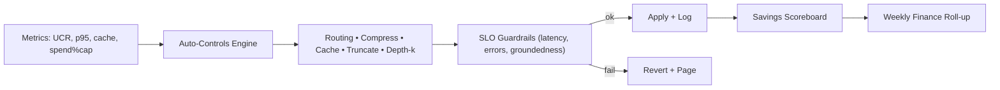

# Week08 — Day05: FinOps in Production (Spend SLOs & Auto-Controls)

*Save as: `wk08/day05_finops_prod_controls.md`*

> **CXO Lens (Deloitte-grade):** We make cost **boring and predictable**. Live **spend SLOs**, anomaly alerts, and **automatic dials** (routing, cache, truncate) keep invoices stable without slowing delivery.

---

## Why this matters (board rationale)

* **Forecastability:** CFO confidence rises when month-end invoices land within **±5%** of plan.
* **Self-healing economics:** When spend drifts, the platform auto-tightens controls **before** humans triage.
* **Speed with guardrails:** Teams ship features while FinOps policy protects margins.

---

## Objectives (today)

* Activate **spend SLOs** by use case / provider / model with **monthly caps** and 75/90/100% thresholds.
* Turn on **auto-controls**: dynamic routing, prompt compression, cache policy, safe truncate.
* Publish a **savings scoreboard** (target vs. actual) and owners for next levers.

---

## Activities (⏱ 75–90 minutes)

1. **Spend SLOs (25m)** — Define caps, thresholds, actions; wire alerts to #finops + approvers.
2. **Auto-Controls (25m)** — Rule engine connects **signals → levers** (UCR, latency, cache-hit).
3. **Scoreboard (15m)** — UCR trend, savings unlocked this week, next three levers with ETAs.
4. **Dry-run (10–25m)** — Simulate 90% cap breach in staging; verify actions and rollbacks.

---

## Deliverables

* `wk08/finops/spend_slo.yaml` — caps, thresholds, actions.
* `wk08/finops/auto_controls.md` — routing/cache/truncate rules and guardrails.
* `wk08/finops/savings_scoreboard.csv` — weekly updated results.

---

## Acceptance & QA

* First-month forecast **±5% vs. plan**; alert paths tested end-to-end.
* Auto-controls reduce **UCR ≥ 10%** with **no SLO regressions** (latency, error rate).
* Finance receives **weekly roll-ups** (chart + 5-bullet commentary).

---

## Spend SLO policy (YAML)

*File: `wk08/finops/spend_slo.yaml`*

```yaml
version: 1
use_cases:
  - id: "ops_copilot"
    monthly_cap_usd: 9000
    thresholds:
      - pct: 0.75
        actions: ["notify:#finops", "enable_prompt_compress", "increase_cache_aggressiveness"]
      - pct: 0.90
        actions: ["route_small_model>=65%", "depth_k=max(4)", "truncate_response_p95=350"]
      - pct: 1.00
        actions: ["freeze_feature_flags=[large_model]", "require_exec_approval", "postmortem_required"]
    exclusions:
      - reason: "security_fix"
        approver: "VP Platform"
      - reason: "sev1_remediation"
        approver: "Head of SRE"
providers:
  - name: "OpenAI"
    cap_usd: 6000
  - name: "LocalLLM"
    cap_usd: 2500
reporting:
  channel: "#finops-weekly"
  artifacts:
    - "ucrecon_dashboard.png"
    - "provider_breakdown.csv"
```

---

## Auto-controls (platform rules)

*File: `wk08/finops/auto_controls.md`*

**Signals (inputs)**

* **UCR (unit cost/request)** rolling 1h and 24h.
* **p95 latency**, **error rate**, **cache hit-rate**, **depth-k**, **rerank count**.
* **Spend SLO burn** (pct of cap) for use case and provider.

**Levers (actions)**

* **Routing:** small/medium/large model share targets.
* **Prompt compression:** template v2 with tighter system + fewer examples.
* **Response cap:** smart truncation at p95 tokens.
* **Cache policy:** raise semantic and exact cache TTL; prewarm for top N intents.
* **Retrieval depth:** cap `k`; reduce re-rank candidates when groundedness is stable.

**Guardrails**

* Never apply levers if it would breach **SLO gates**: p95 ≤ 1200 ms; error ≤ 1.0%; grounded ≥ 4.2/5.
* Changes must be **idempotent**, logged, and **auto-reverted** when conditions clear.

**Pseudocode (controller)**

```python
def finops_controller(metrics, slo, spend):
    actions = []
    if spend.uc_pct >= 1.00:
        actions += ["freeze_large_model", "require_exec_approval"]
    elif spend.uc_pct >= 0.90:
        actions += ["route_small>=0.65", "set_depth_k(4)", "set_response_cap(350)"]
    elif spend.uc_pct >= 0.75:
        actions += ["enable_prompt_compress", "increase_cache_ttl"]

    # Safety checks
    if metrics.p95_latency > slo.p95_latency or metrics.error_rate > slo.error_rate_max:
        actions = [a for a in actions if a not in ["set_response_cap(350)"]]
    if metrics.grounded_score < slo.grounded_min:
        actions = [a for a in actions if not a.startswith("route_small")]

    return actions
```

---

## Savings scoreboard (CSV)

*File: `wk08/finops/savings_scoreboard.csv`*

```csv
week_ending,use_case,lever,owner,target_savings_pct,actual_savings_pct,status,notes
2025-09-12,ops_copilot,prompt_compression,Platform,12,9,In Progress,Template v2 at 60% rollout
2025-09-12,ops_copilot,cache_policy,Platform,15,18,Complete,Semantic cache TTL 30m -> 2h
2025-09-12,customer_copilot,routing_small,ML Ops,10,7,In Progress,Guarded by groundedness ≥4.2/5
2025-09-12,ops_copilot,depth_k_tuning,Search,8,5,Planned,Gates after gameday signoff
```

---

## Dashboards & queries

**Exec view (what to show)**

* **Run-rate vs plan**, **UCR trend**, **savings unlocked vs target**, top spenders by use case/provider/model.

**SQL — monthly roll-up**

```sql
SELECT
  use_case_id,
  provider,
  model_id,
  COUNT(*) AS requests,
  ROUND(SUM(unit_cost_usd), 2) AS spend_usd,
  ROUND(AVG(unit_cost_usd), 4) AS ucr_avg,
  APPROX_PERCENTILE(latency_ms, 0.95) AS p95_latency_ms
FROM finops.request_trace
WHERE ts >= date_trunc('month', current_date)
GROUP BY use_case_id, provider, model_id
ORDER BY spend_usd DESC;
```

**Prometheus rule — spend anomaly (illustrative)**

```yaml
groups:
- name: finops
  rules:
  - alert: SpendAnomaly
    expr: (sum(rate(spend_usd_total{use_case="ops_copilot"}[15m])) /
           sum(rate(requests_total{use_case="ops_copilot"}[15m])))
          > (ucr_baseline{use_case="ops_copilot"} * 1.25)
    for: 10m
    labels: {severity: "notify", team: "finops"}
    annotations:
      summary: "UCR +25% over baseline for ops_copilot"
      runbook: "https://runbooks/finops#ucr-anomaly"
```

---

## RACI (snapshot)

| Workstream           | R (Doer)        | A (Accountable) | C (Consulted)     | I (Informed) |
| -------------------- | --------------- | --------------- | ----------------- | ------------ |
| Spend SLO policy     | FinOps          | CFO             | Platform, Product | ELT          |
| Auto-controls engine | Platform, MLOps | CTO             | SRE, Security     | Org          |
| Forecast & roll-ups  | FinOps          | CFO             | PMs, Providers    | Org          |
| Scoreboard & comms   | FinOps, PMO     | COO             | Product Marketing | Org          |

---

## Mermaid — Signal → Lever → Safe-guard loop



---

## Day-end checklist

* [ ] `spend_slo.yaml` approved; alerts tested in staging.
* [ ] Auto-controls enabled with **rollback** and **audit logs**.
* [ ] Savings scoreboard published; owners + ETAs set for next levers.
* [ ] Finance subscribed to weekly roll-up; first draft sent.

---

## What “great” looks like

* **Invoices within ±5%** of plan; **no surprises**.
* **UCR −10–20%** from baseline with **SLOs intact**.
* Spend burndown + commentary lands **every Friday**; actions are closed the following week.

