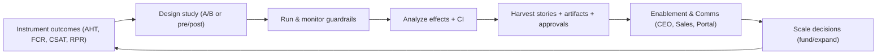

# Week08 — Day06: Adoption, Outcomes & Story Harvest

*Save as: `wk08/day06_adoption_outcomes_story_harvest.md`*

> **CXO Lens (Deloitte-grade):** Adoption isn’t clicks—it’s **value realization**. We prove impact with **instrumented outcomes**, credible experiment design, and **stories that travel** from the front line to the boardroom.

---

## Why this matters (board rationale)

* **Evidence over anecdotes:** Funding scales when **AHT↓, errors↓, revenue↑** are measured and attributable.
* **Change that sticks:** Stories + before/after artifacts accelerate cross-functional adoption.
* **Compliance-ready:** Outcome telemetry with **privacy flags** and lineage withstands audit.

---

## Objectives (today)

* Instrument **business outcomes** (e.g., AHT, CSAT, FCR, Rev/Rep) with baselines and privacy tags.
* Run **A/B or pre/post** studies with sample-size math and guardrails; publish effect sizes.
* Launch **story harvest**: 3+ validated wins with screenshots, quotes, and approvals.

---

## Activities (⏱ 75–90 minutes)

1. **Outcome Telemetry (25m)** — Define events, IDs, baselines; add data contracts & privacy flags.
2. **Study Design (25m)** — Cohorts, randomization/pre-post, metrics, MDE/power, run dates, stop rules.
3. **Story Harvest (15m)** — One-pagers: problem → intervention → outcome; approvals & assets checklist.
4. **Pipeline to Comms (10–25m)** — Route stories to CEO town hall, sales deck, enablement portal.

---

## Deliverables

* `wk08/adoption/outcome_telemetry.md` — schema, contracts, dashboards.
* `wk08/adoption/study_plan.md` — hypothesis, design, sample, analysis plan.
* `wk08/adoption/stories/*.md` — **3+** validated wins with artifacts and approvals.

---

## Acceptance & QA

* **≥ 2 outcome metrics** show stat-sig improvement (or tight confidence bounds).
* **3 stories** approved for CEO town hall / sales deck with privacy review completed.
* Telemetry joins to **decision stack** (features ↔ outcomes) with lineage links.

---

## Outcome telemetry (schema snippet)

*File: `wk08/adoption/outcome_telemetry.md`*

```yaml
stream: ops_copilot_outcomes_v1
owner: product-analytics@company.com
pii: medium
keys:
  - session_id
  - agent_id
  - user_id (hashed)
  - cohort_flag (treatment|control)
fields:
  - aht_seconds: float      # Avg Handle Time per ticket
  - fcr_flag: bool          # First Contact Resolution
  - csat_score: float       # 1–5
  - rev_per_rep_usd: float
  - error_count: int
  - suggestions_accepted: int
context:
  - model_id: string
  - depth_k: int
  - cache_hit: bool
privacy:
  - mask_user_id: sha256(salt)
  - redact_free_text: on
slo:
  freshness_minutes: 60
  completeness_pct: ">= 99.0%"
```

**SQL – daily roll-up**

```sql
SELECT
  date_trunc('day', ts) AS d,
  cohort_flag,
  AVG(aht_seconds) AS aht_s,
  AVG(CASE WHEN fcr_flag THEN 1 ELSE 0 END) AS fcr_rate,
  AVG(csat_score) AS csat,
  AVG(rev_per_rep_usd) AS rpr
FROM ops_copilot_outcomes_v1
WHERE ts >= current_date - INTERVAL '30 days'
GROUP BY 1,2
ORDER BY 1,2;
```

---

## Study design (A/B or pre/post)

*File: `wk08/adoption/study_plan.md`*

**Hypothesis:** “Ops Copilot reduces AHT by **≥ 12%** and increases FCR by **≥ 4pp** without CSAT decline.”

**Design options:**

* **A/B randomized:** Agent-level randomization; stratify by queue, tenure, region.
* **Stepped-wedge (pre/post):** Waves by site; include **synthetic control** if feasible.

**Parameters:**

* **Primary metrics:** AHT (↓), FCR (↑). Secondary: CSAT (≥ baseline), Errors (≤ baseline).
* **MDE & power:** α=0.05, power=0.8; compute N via pooled variance from last 8 weeks.
* **Run dates:** 14 business days; mid-read on day 5 for guardrails only.

**Stop/adjust rules:**

* **Safety:** If error rate +3σ vs. baseline for 2 consecutive days → pause and roll back.
* **Ethics/privacy:** Any PII leak incident → immediate halt and incident playbook.

**Analysis plan (pseudocode):**

```python
# diff-in-means for A/B; diff-in-diff for pre/post
effect = mean(treatment_aht) - mean(control_aht)
ci = bootstrap_ci(effect, n=5000, alpha=0.05)
lift_pct = -effect / mean(control_aht) * 100
```

---

## Story harvest (template)

*Files under: `wk08/adoption/stories/`*

**`ops_aht_12pct_reduction.md`**

```md
# Win: AHT down 14% in Ops Wave 2 (NA)
Problem: High AHT in Tier-1 queue, QA defects trending up.
Intervention: Ops Copilot (retrieval v2, smart truncate), enablement labs.
Outcome: AHT −14% (CI: −11% to −17%), FCR +3.8pp, CSAT flat (−0.03).
Evidence: dashboards/aht_wave2.png, queries/aht_ab.sql
Quote: “I close tickets faster without guessing.” — Team Lead, Dallas
Screens: ./screens/ops_before_after.png
Privacy: IDs hashed, PHI redacted. Approvals: Legal ✅, PMM ✅
```

**`sales_rev_per_rep_6pct_lift.md`**

```md
# Win: Revenue per Rep +6.2% in SMB Segment
Problem: Rep ramp slow; content scattered.
Intervention: Sales Copilot (guided talk tracks, inline citations).
Outcome: Rev/Rep +6.2% (CI: +3.1% to +9.4%), Win rate +1.2pp.
Evidence: dashboards/rpr_smb.png, queries/sales_diffdiff.sql
Quote: “I spend more time selling, less time searching.” — AE, West
Privacy: Customer names blurred. Approvals: Legal ✅, Sales Ops ✅
```

---

## Dashboards (what to show)

* **Outcomes:** AHT, FCR, CSAT, Rev/Rep — **trend + treatment vs control**.
* **Attribution:** Feature toggles ↔ outcome shifts; **intervention log overlay**.
* **Quality & safety:** Error rate, privacy incidents, guardrail hits (post-release).
* **Adoption depth:** DAU, query/session, suggestions\_accepted rate.

---

## RACI (snapshot)

| Workstream            | R (Doer)          | A (Accountable) | C (Consulted) | I (Informed) |
| --------------------- | ----------------- | --------------- | ------------- | ------------ |
| Telemetry & contracts | Product Analytics | Head of Product | Data Platform | ELT          |
| Experiment design     | Analytics Science | VP Product      | Legal, CISO   | Org          |
| Story harvest         | PMM + Champions   | CMO             | Legal, Brand  | Org          |
| Dashboards & roll-ups | Analytics Eng     | COO             | PMs, SRE      | Org          |

---

## Privacy & approvals checklist

* [ ] IDs hashed; PII/PHI redacted in screenshots.
* [ ] Quotes **approved** by individuals and their managers.
* [ ] Vendor logos only with contract approval.
* [ ] Link **data lineage** for every chart/table.

---

## Mermaid — Value realization loop



---

## Day-end checklist

* [ ] Telemetry schema live with **freshness ≥ 99%** and privacy flags.
* [ ] Study plan approved; experiment **in flight** with stop/adjust rules.
* [ ] **3 win stories** drafted with evidence and approvals.
* [ ] Dashboards published; links added to the enablement portal.

---

## What “great” looks like

* **Stat-sig outcomes** with clean attribution and transparent caveats.
* **Stories that travel**: concise, visual, approved—reused in CEO town hall and sales.
* **Feedback loop:** Findings inform backlog, guardrails, and next wave targeting.

