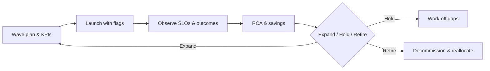

# Week08 — Day07: Executive Scale Readout — Wave Performance & Next Capital Call

*Save as: `wk08/day07_exec_scale_readout_next_capital_call.md`*

> **CXO Lens (Deloitte-grade):** We treat scale as a **managed portfolio**. Today we show **value realized**, **risk posture**, and **cost discipline**—then make a **capital call** with conviction. If proof isn’t there, we **pause with discipline**.

---

## Why this matters (board rationale)

* **Evidence over aspiration:** We report **outcomes, not promises**.
* **Guardrails honored:** Scale did **not** compromise SLOs, safety, or privacy.
* **Capital efficiency:** Dollars move to the **highest-return paths**—and exit where value is weak.

---

## Objectives (today)

* Present **Wave performance** (value, SLOs, incidents, cost).
* Decide **Expand / Hold / Retire** per use case and **reallocate capital**.
* Approve the **next 90-day plan** and enablement boosts aligned to winners.

---

## Inputs (artifact pack)

| Stream      | Artifact                             | Where                                |
| ----------- | ------------------------------------ | ------------------------------------ |
| Value       | Outcome studies, KPI deltas, stories | `wk08/adoption/*`                    |
| Reliability | PRR, Gameday, incident RCA           | `wk08/readiness/*`                   |
| Safety      | MRM & eval deltas vs Week07          | `wk07/mrm/*`, `wk08/observability/*` |
| Economics   | Spend SLOs, UCR trend, savings       | `wk08/finops/*`                      |
| Scale       | Wave plan, burndown, critical path   | `wk08/scale/*`                       |

---

## Agenda (⏱ 75–90 minutes)

1. **Readout (20m)** — value realized, SLO adherence, incident summary, UCR trend.
2. **Decisions (25m)** — **Expand / Hold / Retire**; budget shifts; hiring updates.
3. **Next 90 (20m)** — outcomes, waves, enablement, risk work-offs.
4. **Comms (10–25m)** — CEO note, ELT bullets, customer-safe stories.

---

## Decision criteria (traffic-light v2)

| Dimension     | **Expand**                          | **Hold** (fix ≤ 30 days)        | **Retire**                         |
| ------------- | ----------------------------------- | ------------------------------- | ---------------------------------- |
| **Value**     | ≥ target with **stat-sig**          | Trending up; CI overlaps target | Below hurdle; **no credible path** |
| **SLOs**      | Met with **headroom**               | Tight; known work-offs          | **Chronic breaches**               |
| **Safety**    | All evals green; rollback tested    | 1–2 yellows with ETA            | Red or **privacy risk**            |
| **Economics** | UCR ↓ q/q; within **±5%** forecast  | **±15%** with defined levers    | **Uncapped** or opaque spend       |
| **Adoption**  | ≥ target DAU, **>70% task success** | Slow uptake; UX issues          | Low utility / **trust gap**        |

> **Rule:** Any **Red** ⇒ Retire (or convert to Hold only with a 30-day, owner-backed plan). Majority **Green**, no Reds ⇒ Expand.

---

## Slide outline (executive ready)

1. **Wins & “Why Now” (1 slide)** — hours saved, revenue unlocked, risk reduced.
2. **Use-case scorecards (1/UC)** — Value, SLO, Safety, UCR, Adoption.
3. **Incidents & RCA (1)** — what happened, what changed, proof.
4. **Economics (1)** — UCR trend, savings unlocked vs plan, next levers.
5. **Scale plan (1)** — next waves, geos, freeze windows, rollback criteria.
6. **Enablement (1)** — Champions reach, labs, story pack for Sales/CS.
7. **Decision ask (final)** — Expand/Hold/Retire + budget/headcount.

---

## Capital call framing (board one-pager)

**Ask:** `$X` to fund **\<Use Case / Wave / Geo>** through `<Quarter>`
**Why:** Met **Value/SLO/Safety/Economics** thresholds; see proof links.
**Return model:** Outcome delta × eligible volume × adoption × confidence ⇒ `${Y}/quarter`
**Controls:** Spend SLOs, freeze windows, rollback proof, error budgets.
**Exit:** Vendor portability + table-top switch drill passed.

---

## Deliverables (today)

* `wk08/exec_scale_readout.md` — narrative + slide links + evidence.
* `wk08/decision_log.md` — each decision with **owner, budget, due, proof**.
* `wk08/next_90_plan.md` — outcomes, milestones, dashboards, cadence.

---

## Example decision log entry

```yaml
id: DEC-2025-09-14-01
title: EXPAND — Ops Copilot Wave 3 (EU)
owner: VP Ops
budget_usd: 300000
evidence:
  - wk08/adoption/study_plan.md#results
  - wk08/observability/slo_dashboards.png
  - wk08/finops/savings_scoreboard.csv
guardrails:
  - p95_latency_ms <= 1200
  - grounded_score >= 4.3/5
  - unit_cost_usd <= 0.0095
milestones:
  - wave3_launch: 2025-10-28
  - eu_privacy_update: 2025-10-10
status: Approved
```

---

## Portfolio view (quick grid)

| Use case            | Decision | Budget Δ | Next wave | Key risk → mitigation              |
| ------------------- | -------- | -------: | --------- | ---------------------------------- |
| Ops Copilot (NA→EU) | Expand   |  +\$300k | Wave 3 EU | Residency nuance → contract update |
| Customer Copilot    | Hold     |        — | Gap work  | SLO margin tight → cache + routing |
| Legacy Summarizer   | Retire   |  −\$150k | Sunset    | Decomms plan & learnings write-up  |

---

## Metrics to show (cheat sheet)

* **Value:** AHT↓, FCR↑, CSAT ≥ baseline; Rev/Rep↑; CI & effect sizes.
* **SLOs:** p95 latency, error rate, cache hit, depth-k distribution.
* **Safety:** eval pass rate, incident MTTR, rollback drill timestamps.
* **Economics:** UCR trend, forecast vs. cap (±%), savings unlocked by lever.
* **Adoption:** DAU, tasks completed, suggestions\_accepted, cohort coverage.

---

## Mermaid — Scale Governance Loop



---

## Acceptance & QA

* Decisions **logged in 24h** with budgets, owners, and evidence links.
* **Next-90 plan approved**; calendars & dashboards updated.
* CEO/ELT comms **queued**; Champions briefed on new focus areas.

---

## What “great” looks like

* **Outcomes first:** Specific hours saved, revenue unlocked, or risk reduced—**with proof**.
* **Cost discipline:** Spend SLOs held; **UCR trending down** with documented levers.
* **Operational calm:** Incidents rare, small, and closed fast; **rollback is muscle memory**.

